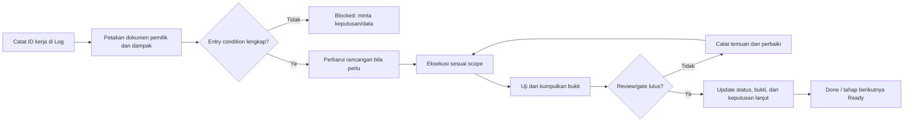

# 00. Pedoman Eksekusi Berbasis Markdown

Dokumen ini adalah aturan kerja wajib proyek. Mulai saat ini, setiap keputusan, perubahan rancangan, implementasi, pengujian, konfigurasi, deployment, maupun tindakan operasional voting **harus memiliki dasar dan jejak pada file Markdown di folder `docs/`**.

Tujuannya bukan menambah birokrasi, melainkan memastikan website voting dibangun konsisten, dapat diaudit, tidak kehilangan keputusan penting, dan aman terhadap perubahan dadakan saat event berlangsung.

## Prinsip sumber kebenaran

1. `docs/README.md` adalah indeks dan register status proyek.
2. Dokumen bernomor adalah sumber aturan untuk area masing-masing. Jika implementasi bertentangan dengan dokumen, implementasi dianggap belum benar sampai dokumen dan keputusan diselaraskan melalui review.
3. `15-runbook-eksekusi-proyek.md` adalah urutan pengerjaan dan gate. Tidak boleh melompati gate.
4. `16-log-eksekusi.md` adalah catatan kerja aktif. Setiap tindakan material harus dicatat sebelum dikerjakan dan ditutup setelah buktinya ada.
5. `docs/data/` adalah restricted. Dokumen di sana tidak boleh ikut deployment, static export, SEO, analitik, atau kanal visitor.

Urutan otoritas bila ada konflik:

```text
Keputusan panitia yang tercatat dan disetujui
  → aturan keamanan, privasi, dan integritas suara
  → kontrak data/API serta quality gate
  → runbook eksekusi
  → desain visual dan implementasi kode
```

Keputusan lisan, chat, atau asumsi belum menjadi dasar kerja sampai diringkas ke Markdown, diberi tanggal, pemilik keputusan, dan status persetujuan.

## Aturan tidak dapat dinegosiasikan

| Aturan | Penerapan |
| --- | --- |
| No MD, no action | Tidak ada coding, import data, setup calon, perubahan konfigurasi, reset, atau deploy tanpa entry aktif pada `16-log-eksekusi.md` dan rujukan dokumen pemilik. |
| Satu perubahan, satu jejak | Setiap perubahan memiliki ID kerja, tujuan, scope, dokumen terdampak, owner, status, bukti, dan keputusan lanjut. |
| Dokumentasi lebih dahulu | Untuk perubahan requirement/proses/data/API, perbarui dokumen sebelum atau dalam perubahan yang sama dengan kode. Tidak boleh menunda dokumen ke pekerjaan berikutnya. |
| Gate sebelum lanjut | Tahap berikutnya hanya dimulai jika entry condition dan bukti exit dari tahap sebelumnya terpenuhi. |
| Bukti, bukan klaim | Status `Done` hanya boleh dipakai bila link/file bukti test, review, screenshot ter-redaksi, checksum, atau sign-off tersedia. |
| Dua admin untuk tindakan sensitif | Import final, publish calon, open/close event, void, reset draft, ekspor restricted, dan perubahan produksi mengikuti dua akun `admin` berbeda serta audit. |
| Tidak ada PII di log biasa | NIM, nama pemilih, IP, token, password, receipt lengkap, atau pilihan individu tidak ditulis dalam log, issue, commit, screenshot, maupun dokumen publik. Gunakan ID internal ter-redaksi atau referensi secure. |
| Stop saat tidak pasti | Bila dokumen konflik, data belum sah, atau integritas suara diragukan, tandai `Blocked` dan jangan mengambil jalan pintas. |

### Pengecualian prototipe lokal yang terkontrol

Sebelum T1–T4 selesai, hanya **prototipe lokal non-production** yang boleh dibangun setelah T0 `Done` dan ada entry `EXE-*` aktif. Pengecualian ini dibuat agar desain, responsivitas, dan alur UI dapat divalidasi lebih awal tanpa berpura-pura bahwa sistem sudah siap menerima suara.

Prototipe wajib memenuhi seluruh batas berikut:

- memakai fixture dummy atau materi publik yang sudah ada; tidak membaca, mengimpor, atau mengirim spreadsheet/NIM;
- tidak memiliki autentikasi admin, endpoint production, database production, analytics, atau deployment publik;
- tidak menyimpan suara sebagai data final; angka hasil hanya simulasi lokal dan diberi label **Demo / belum voting resmi**;
- tidak mengklaim lulus integritas, privasi, anti-kecurangan, atau go-live;
- tidak mengubah urutan gate T1–T12. T5/T9 baru dapat dinyatakan selesai setelah prasyarat normalnya disetujui.

Setiap perluasan dari prototipe ke data nyata, persistence, NIM, akun admin, atau deployment wajib berhenti dan kembali ke gate T1–T4.

## Status kerja yang dipakai

| Status | Arti | Boleh lanjut? |
| --- | --- | --- |
| `Planned` | Pekerjaan terdaftar tetapi belum diperiksa. | Tidak. |
| `Ready` | Scope, dokumen, owner, dan entry condition lengkap. | Ya, mulai sesuai runbook. |
| `In progress` | Sedang dikerjakan; log harus diperbarui bila ada temuan. | Hanya di scope yang tercatat. |
| `In review` | Implementasi/aksi selesai, menunggu verifikasi pihak yang tepat. | Tidak ke tahap berikutnya. |
| `Blocked` | Ada keputusan, data, akses, atau risiko yang belum terselesaikan. | Tidak; tulis blocker dan pihak yang dibutuhkan. |
| `Approved` | Reviewer/panitia sudah menyetujui artefak atau konfigurasi. | Ya, jika gate lain terpenuhi. |
| `Done` | Bukti lulus tersimpan, tautan valid, dan dampak didokumentasikan. | Ya. |
| `Cancelled` | Tidak dijalankan; alasan dan dampak telah dicatat. | Tidak berlaku. |

`Approved` adalah status persetujuan; `Done` adalah status penyelesaian. Keduanya tidak boleh dipakai saling menggantikan.

## Siklus setiap pekerjaan



### Langkah wajib per ID kerja

1. Buat ID berbentuk `EXE-YYYYMMDD-NN` di `16-log-eksekusi.md`.
2. Tulis tujuan, scope eksplisit, out-of-scope, tahap runbook, owner, reviewer, dan dokumen pemilik.
3. Pastikan semua keputusan yang diperlukan sudah berstatus `Approved`; jika belum, tandai `Blocked`.
4. Jika pekerjaan mengubah requirement, data, API, keamanan, visual, atau SOP, perbarui file Markdown terkait pada perubahan yang sama.
5. Jalankan aksi hanya dalam scope yang tertulis. Temuan baru yang memperluas scope menjadi entry kerja baru atau amendment yang direview.
6. Jalankan quality gate yang relevan dan simpan referensi bukti aman.
7. Minta review sesuai matriks otoritas, lalu ubah status ke `Done` atau `Blocked` dengan alasan.
8. Perbarui `README.md` bila status keputusan proyek, urutan dokumen, atau risiko utama berubah.

## Matriks dokumen pemilik

| Jenis perubahan | Dokumen yang wajib dibaca | Dokumen yang wajib diperbarui bila berubah |
| --- | --- | --- |
| Scope, posisi yang dipilih, jadwal, kebijakan hak pilih/hasil | `01`, `02`, `09`, `15`, `16` | `01`, `02`, `05`, `09`, `10`, `README` bila status berubah. |
| Privasi, faktor identitas, anti-penyalahgunaan, retensi | `03`, `06`, `07`, `08`, `10` | `03`, `06`, `07`, `08`, `09`, `10`. |
| Data master/import/eligible | `03`, `07`, `09`, `10`, `data/*` restricted | `03`, `07`, `09`, `10`, data restricted, `16`; jangan masukkan PII ke dokumen umum. |
| Calon, visi-misi, nomor urut, materi poster | `11`, `14`, data mapping restricted, `09` | `11`, `14`, data mapping restricted, `16`. |
| Database, API, realtime, auth, admin | `06`, `07`, `08`, `10` | Dokumen yang kontraknya terdampak dan `16`. |
| UI responsif, animasi, SEO, aksesibilitas | `04`, `05`, `10`, `12` | `04`, `05`, `10`, `12` bila rute/metadata berubah. |
| Reset, pemilihan ulang, open/close, ekspor, insiden | `09`, `13`, `10`, `16` | `09`, `13`, `16`, dan incident record restricted bila ada. |
| Dependency, layanan hosting, environment, deploy | `05`, `06`, `10`, `15` | `05`, `06`, `10`, `15`, `16`, serta README bila keputusan belum ada sebelumnya. |

Nomor dokumen di atas mengacu pada nama file dalam `README.md`.

## Otoritas review

Peran berikut adalah fungsi kerja, bukan role aplikasi baru; aplikasi tetap hanya memiliki `visitor` dan `admin`.

| Keputusan/aksi | Pengaju | Penyetuju minimum | Bukti |
| --- | --- | --- | --- |
| Perubahan desain atau teks publik sebelum open | Pelaksana | 1 admin reviewer | Preview dan entry log. |
| Kontrak data/API, auth, anti-fraud, retensi | Pelaksana teknis | Admin penanggung jawab + reviewer teknis | Review dokumen dan hasil test. |
| Import master final, mapping calon, publish calon | Admin operasional | Admin kedua yang berbeda | Audit dan checklist restricted. |
| Open/close event, reset draft, void, pemilihan ulang | Admin penanggung jawab | Admin kedua yang berbeda | Reason, audit, snapshot sebelum/sesudah. |
| Deployment production atau rollback | Pelaksana teknis | Admin penanggung jawab | Build, smoke test, rollback plan. |
| Pengumuman hasil | Humas/admin penanggung jawab | Admin review | Rekap tersahkan dan teks publik. |

## Bentuk bukti yang dapat diterima

- hasil perintah test/lint/typecheck/build yang diringkas, dengan lokasi artefak;
- laporan uji E2E/integrasi/load test yang tidak memuat PII;
- screenshot responsif atau rekaman singkat yang sudah disensor;
- checksum konfigurasi/ekspor, timestamp, dan audit ID;
- tautan pull request/commit atau daftar file perubahan;
- sign-off admin/panitia dengan nama fungsi, tanggal, dan keputusan.

Klaim seperti “sudah aman”, “sudah dites”, atau “sudah disetujui” tanpa bukti tidak dapat menutup gate.

## Penanganan konflik, amendment, dan darurat

1. **Konflik dokumen:** tandai pekerjaan `Blocked`, sebutkan file/bagian yang konflik, dan minta keputusan panitia. Jangan memilih versi sendiri.
2. **Perluasan scope:** buat amendment pada entry kerja berisi alasan, dokumen dampak, risiko, dan reviewer. Jika mengubah integritas/privacy, kembali ke gate yang relevan.
3. **Darurat saat event open:** ikuti severity di `09-sop-panitia.md`. Buat entry insiden sesegera mungkin, preserve bukti, dan hanya lakukan aksi yang sudah diotorisasi. Perubahan visual/dependency bukan aksi darurat.
4. **Dokumen stale:** jika realitas sistem telah berubah, status dokumen diberi `Needs update` di log dan pekerjaan yang bergantung padanya tidak boleh ditutup sebelum diselaraskan.

## Kriteria keberhasilan tata kelola

Tata kelola ini berhasil bila seorang admin baru dapat menjawab empat pertanyaan hanya dari folder `docs/`: apa yang sedang dikerjakan, mengapa, aturan apa yang berlaku, dan bukti apa yang membuktikan pekerjaan tersebut layak dilanjutkan.
