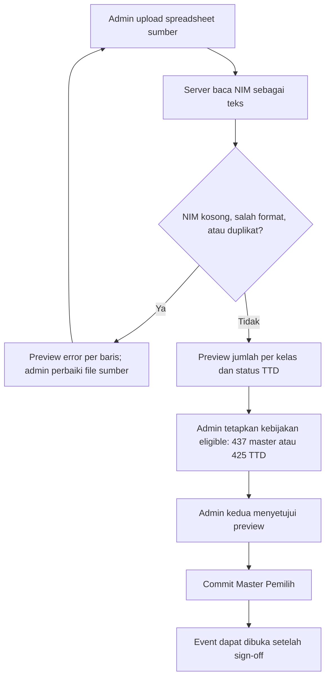
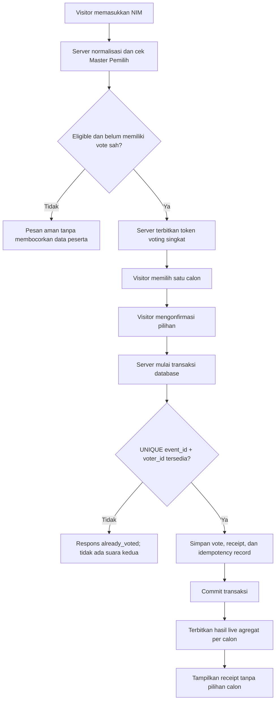
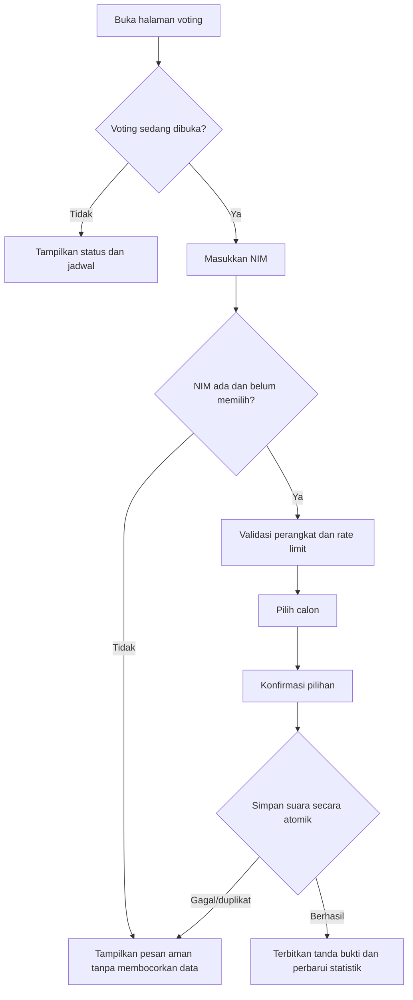
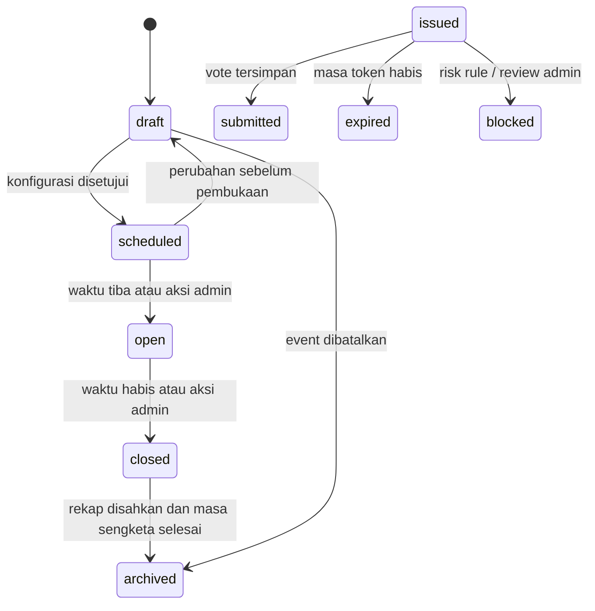

# 02. Alur Voting

## Role aplikasi

| Peran | Hak akses |
| --- | --- |
| `visitor` | Memeriksa NIM, memilih satu calon, menerima bukti bahwa suara telah tercatat, serta melihat hasil live publik. |
| `admin` | Mengelola event/calon/import, melihat audit dan rekap, mengekspor data, serta membuka/menutup voting. |

Tidak ada role `operator`, `auditor`, atau `supervisor`. Tindakan sensitif seperti void memakai dua akun `admin` berbeda, bukan role tambahan.

## Proses daftar peserta dan pencegahan duplikasi

Spreadsheet adalah sumber awal, bukan database yang dibaca langsung oleh halaman voting. Admin mengimpornya menjadi **Master Pemilih** internal. Tabel admin hanya menampilkan status partisipasi (`Belum memilih` atau `Sudah memilih`); pilihan calon tidak boleh ditampilkan pada daftar peserta.

### Kolom Master Pemilih di dashboard admin

| Kolom | Sumber/aturan | Tampil pada admin |
| --- | --- | --- |
| NIM | Spreadsheet; string digit, unik per event. | Ya, hanya admin terautentikasi. |
| Nama | Spreadsheet sumber. | Ya, hanya admin terautentikasi. |
| Kelas | Spreadsheet sumber. | Ya; dapat difilter. |
| TTD | Referensi kehadiran dari file sumber. | Ya; bukan hak pilih otomatis. |
| Eligible | Kebijakan event/override beralasan. | Ya; dapat difilter. |
| Status voting | Diturunkan dari ada/tidaknya vote sah. | Ya, hanya `Belum memilih` atau `Sudah memilih`. |
| Pilihan calon | Data vote sangat terbatas. | Tidak pada tabel peserta atau ekspor partisipasi biasa. |

### Proses seorang visitor melakukan voting

**Pengunci utama anti-duplikasi** adalah constraint database `UNIQUE(election_id, voter_id)` dan transaksi server. Kondisi ini tetap aman ketika NIM sama mencoba mengirim dari dua HP, dua browser, atau dua tab pada waktu hampir bersamaan: hanya commit pertama yang sah. `idempotency key` membuat retry akibat jaringan mengembalikan receipt yang sama, bukan menciptakan vote baru. IP hash, device signal, dan CAPTCHA hanya berperan sebagai rate limit/sinyal risiko, bukan identitas utama atau alasan penolakan otomatis.

Mode device-integrity pada `20-integritas-perangkat-dan-anti-duplikasi.md` menambahkan dua claim browser unik pada commit tanpa OTP: cookie server `HttpOnly` dan token instalasi local storage, keduanya hanya tersimpan sebagai HMAC. IP tetap tidak menjadi constraint unik agar perangkat berbeda pada Wi-Fi yang sama tetap dapat memilih. Mode ini mencegah duplikasi teknis normal, bukan membuktikan kepemilikan NIM atau perangkat fisik; source menunggu migration staging, test, dan UAT sebelum event dibuka.

## Alur pemilih

## Aturan suara

1. Server adalah satu-satunya pihak yang memutuskan validitas suara.
2. Pilihan calon tidak disimpan di browser sebagai sumber kebenaran.
3. Setelah konfirmasi, suara bersifat final. Fitur ubah suara tidak disediakan pada versi pertama.
4. Transaksi penyimpanan wajib memiliki constraint unik `event_id + voter_id`; pengecekan UI saja tidak cukup.
5. Pesan kesalahan harus generik: tidak menampilkan nama peserta, status hadir, atau detail perangkat kepada pihak yang tidak berwenang.

## Hasil live

Publik selama voting terbuka dapat melihat:

- jumlah suara sah setiap calon;
- persentase suara setiap calon terhadap total suara sah;
- jumlah suara sah dan tingkat partisipasi terhadap daftar pemilih;
- status buka/tutup serta hitung mundur.

Pembaruan menggunakan kanal realtime dengan fallback polling ringan; angka akhir selalu diambil kembali dari server saat halaman dimuat. Hasil per calon tidak boleh memuat NIM, nama pemilih, atau waktu vote individual.

## Operasional dan sengketa

- Import peserta divalidasi lebih dulu dalam mode pratinjau: NIM wajib unik, nama dan kelas dinormalisasi, dan baris tidak valid dilaporkan.
- Admin tidak dapat mengedit atau menghapus suara final dari UI biasa.
- Koreksi exceptional hanya melalui prosedur dua pihak: satu admin mengajukan pembatalan dan admin lain menyetujuinya; alasan dan jejak sebelum/sesudah tersimpan dalam audit log.
- Setelah voting ditutup, sistem membuat rekap terkunci dan checksum ekspor untuk arsip panitia.

## State machine event dan sesi

`open -> closed` hanya mengubah penerimaan request baru; ia tidak membatalkan vote yang sudah di-commit sebelum batas server. State browser tidak pernah menjadi sumber transisi event.

## Tiga tahap UI pemilih

Semua proses pemilih berlangsung dalam satu route `/vote`; status event diperiksa otomatis ketika route dibuka dan receipt muncul hanya setelah server menerima suara.

| Tahap | Input/aksi | Validasi server | Output aman |
| --- | --- | --- | --- |
| 1. Verifikasi NIM | NIM + anti-bot challenge bila policy memicu. | Event `open`, format, master, eligible, belum memiliki vote, rate limit, serta policy perangkat. | Token sesi opaque atau pesan generik. |
| 2. Pilih calon | Tekan satu radio ballot; lihat ringkasan bila perlu. | UI hanya; calon diverifikasi lagi saat submit. | Satu pilihan lokal dan tombol lanjut. |
| 3. Konfirmasi & kirim | Submit `candidateId` + token + idempotency key. | Token, cookie browser, calon published, foreign relation, unique voter/cookie/instalasi, dan rate limit. | Receipt bila accepted; kode error aman bila gagal. |

Receipt diterbitkan setelah tahap tiga, bukan tahap input keempat. Halaman receipt tidak menampilkan pilihan calon atau PII.

## Kasus batas dan pemulihan

| Kondisi | Perilaku yang wajib |
| --- | --- |
| Pemilih membuka dua tab | Kedua tab dapat memilih calon, tetapi hanya transaksi pertama yang sah; tab kedua menerima status sudah memilih. |
| Jaringan putus setelah submit | Browser tidak mengasumsikan gagal. Retry memakai idempotency key; server mengembalikan receipt sama. |
| Pemilih menekan Back setelah sukses | Halaman vote meminta status terbaru; tidak menampilkan form memilih ulang. |
| Token habis saat di halaman calon | Minta verifikasi ulang; pilihan UI boleh dipertahankan sebagai kenyamanan tetapi tidak auto-submit. |
| Calon diarsipkan saat draft | Tidak terlihat/dapat dipilih. Calon published terkunci ketika event open. |
| Server sibuk | Tampilkan status sementara dan jangan memberikan ilusi bahwa suara masuk sebelum receipt diterima. |

## Aturan penghitungan hasil live

- `total_cast` adalah jumlah vote sah yang belum void, bukan jumlah request submit.
- `candidate_vote_count` dihitung dari vote sah calon tersebut.
- `candidate_vote_percent = candidate_vote_count / total_cast * 100`; ketika `total_cast = 0`, persentase tampil `0%` dan tidak melakukan pembagian nol.
- Jumlah calon dapat berubah saat draft, tetapi tidak boleh berubah setelah event open.
- Browser menampilkan timestamp pembaruan terakhir dan melakukan refetch bila revision realtime terlewat.
