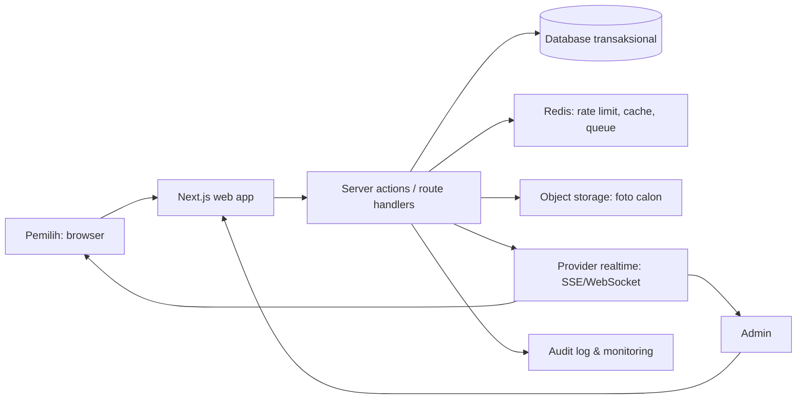
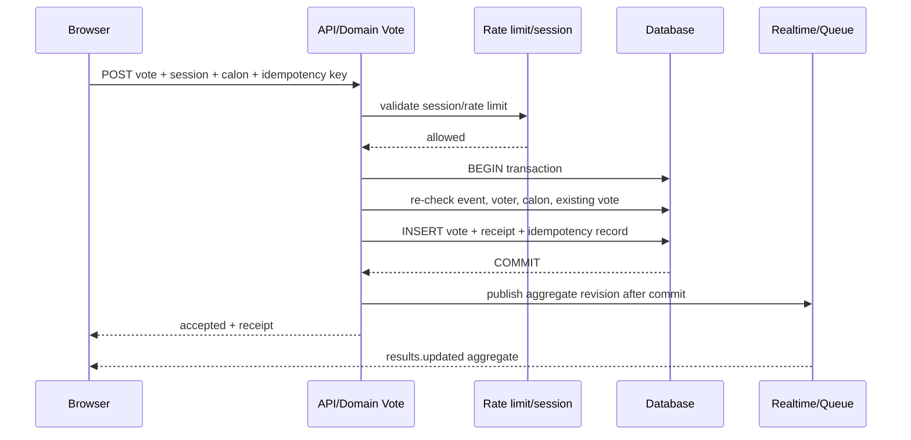

# 06. Arsitektur Teknis

## Prinsip arsitektur

- Semua keputusan keamanan dan validitas suara berada di server.
- Browser hanya menampilkan data publik dan mengirim intent pemilih; tidak menentukan eligible, status periode, atau hasil final.
- Data PII, data pilihan, data audit, dan data publik dipisahkan pada query, endpoint, dan hak akses.
- Satu source of truth adalah database transaksional. Cache dan kanal realtime hanya menyalurkan salinan agregat yang dapat dibangun ulang.
- Aplikasi harus tetap benar apabila pengguna membuka beberapa tab, menekan tombol berulang, jaringan putus, atau dua request tiba bersamaan.

## Komponen



## Batas layer

| Layer | Tanggung jawab | Tidak boleh |
| --- | --- | --- |
| UI publik | Render calon, form, status, agregat hasil. | Membuka data pemilih atau menyimpan suara tanpa server. |
| UI admin | Form konfigurasi, impor, review, ekspor. | Mengandalkan hidden button tanpa server-side admin policy. |
| Domain election | State event, eligibility, vote final, receipt, rekap. | Mengandalkan cache sebagai sumber kebenaran. |
| Persistence | Transaction, foreign key, unique/index, enkripsi. | Menghapus/menimpa suara final secara diam-diam. |
| Realtime | Broadcast agregat/invalidasi cache. | Broadcast NIM, session, IP, atau vote individual. |
| Background jobs | Parse impor, generate ekspor, notifikasi, housekeeping. | Menjalankan keputusan suara yang belum di-commit. |

## Struktur aplikasi Next.js

```text
src/
  app/
    (public)/page.tsx
    (public)/kandidat/page.tsx
    (public)/vote/page.tsx
    (public)/hasil/page.tsx
    (public)/kandidat/[slug]/page.tsx
    (public)/panduan-voting/page.tsx
    (public)/tentang-pemilihan/page.tsx
    (public)/bantuan/page.tsx
    (public)/kebijakan-privasi/page.tsx
    (public)/bukti/[receiptCode]/page.tsx
    (admin)/panitia/...
    api/v1/.../route.ts
    robots.ts
    sitemap.ts
  features/
    election/
    voting/
    candidates/
    voters/
    imports/
    audit/
  components/
    ui/
    voting/
    results/
  lib/
    auth/
    db/
    security/
    realtime/
  jobs/
  tests/
```

`features` memegang use case dan schema validasi domain. `app` hanya mengorkestrasi request/response dan rendering. `components` tidak mengakses database langsung. Struktur ini dapat disesuaikan, tetapi pemisahan tanggung jawabnya wajib dipertahankan.

## Strategi state voting

1. Pemilih memasukkan NIM ke endpoint verifikasi yang diberi rate limit.
2. Server hanya mengembalikan token sesi voting berumur pendek jika NIM eligible dan belum memilih. Nama lengkap tidak perlu dikembalikan.
3. Saat submit, server memverifikasi token, periode, calon aktif, dan eligibility sekali lagi di dalam transaksi.
4. Insert `Vote` dilakukan dengan unique constraint. Konflik unique menjadi respons `already_voted`, bukan error server umum.
5. Setelah commit, server membuat receipt acak, mencatat audit minimum, lalu menerbitkan event agregat.
6. UI menampilkan receipt. Refresh atau retry dengan idempotency key harus mengembalikan hasil submit yang sama, bukan membuat suara kedua.

## Ketersediaan dan kegagalan

| Kondisi | Perilaku yang diperlukan |
| --- | --- |
| Realtime mati | Halaman hasil fallback ke polling agregat dengan interval konservatif. Voting tetap berfungsi. |
| Cache/Redis mati | Hindari mode terbuka; rate limit dapat fail-closed untuk endpoint sensitif atau gunakan limit DB sementara. Vote commit tetap lewat database. |
| Provider realtime gagal | Commit suara tidak dibatalkan. Job retry menyelaraskan agregat dan admin melihat indikator degradasi. |
| Browser timeout setelah submit | Pemilih dapat mengirim ulang idempotency key yang sama atau mengecek receipt; server tidak menduplikasi suara. |
| Database tidak tersedia | Voting ditampilkan sebagai sementara tidak tersedia. Jangan menerima suara lokal/offline. |

## Konfigurasi rahasia

- Rahasia database, token encryption, provider realtime, object storage, dan kredensial email berada di secret manager/env deployment, bukan repo atau log.
- Pisahkan environment development, staging, dan production beserta database serta key masing-masing.
- Rotasi key dan prosedur revoke akses admin harus tersedia sebelum produksi.

## Urutan transaksi vote



Jika salah satu validasi sebelum commit gagal, transaksi dibatalkan dan tidak ada realtime event. Jika publish realtime gagal setelah commit, vote tetap sah; worker retry/invalidasi cache akan menyelaraskan hasil.

## Cache dan konsistensi

| Data | Cache | Invalidation | Sumber kebenaran |
| --- | --- | --- | --- |
| Landing/event publik | CDN/edge TTL pendek | Saat event/calon berubah | Database. |
| Profil calon | CDN TTL sedang | Saat draft dipublikasi; terkunci saat open | Database/object storage. |
| Hasil live | Cache pendek + revision | Setelah commit vote/void | Query agregat database. |
| Session/rate limit | Redis TTL pendek | Kedaluwarsa/revoke | Redis + verifikasi DB saat submit. |
| Admin dashboard | No-store atau cache private | Per request/action | Database. |

Cache tidak pernah mengizinkan submit vote. Saat data cache berbeda dengan database, hasil query database menang dan event realtime revision diperbaiki.

## Background jobs

| Job | Trigger | Idempotensi | Gagal/retry |
| --- | --- | --- | --- |
| Parse import | Admin mengunggah file | Hash file + import ID | Tandai `rejected` dengan error per baris; file asli tetap restricted. |
| Commit import | Review disetujui | Satu commit per import ID | Transaction rollback penuh. |
| Build export | Admin meminta export | Request/export ID | Retry aman; URL unduh singkat. |
| Sync result revision | Vote/void commit | Revision monotonik | Retry sampai cache/realtime sesuai. |
| Retention cleanup | Scheduler | Tombstone/retention job ID | Log jumlah record; tidak menghapus arsip legal. |
| Security alert | Threshold anomaly tercapai | Correlation ID | Notify owner; tidak auto-block semua pemilih. |

## Observability

Setiap request menerima correlation ID yang diteruskan ke log domain, job, audit, dan respons error aman. Metrik minimum: latency p50/p95/p99, error 4xx/5xx, verify success/fail agregat, submit accepted/conflict, database connection, cache health, queue depth, realtime connection/reconnect, dan export duration. Trace dan log production menerapkan redaksi field PII.

## Deployment dan recovery

- Pisahkan application runtime, database, Redis, object storage, dan provider realtime sesuai akses least privilege.
- Health check hanya menyatakan siap bila aplikasi dapat melakukan query ringan dan dependency kritis sesuai mode event; jangan menyatakan sehat saat vote commit sebenarnya gagal.
- Backup database dilakukan sebelum event dan sebelum migration; pemulihan diuji di staging, bukan diasumsikan.
- Recovery mengutamakan integritas: hentikan penerimaan bila state tidak dapat diyakini, rekonsiliasi rekap dari database, catat incident, lalu buka kembali hanya atas persetujuan admin yang ditunjuk.
