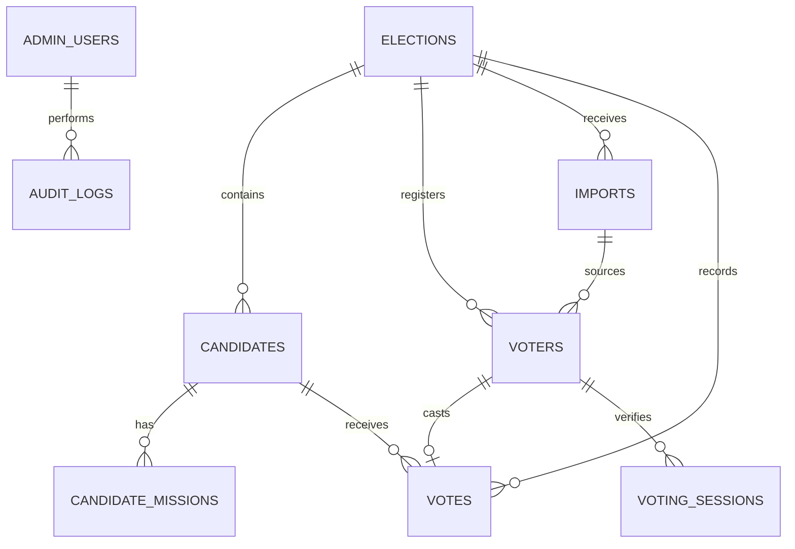

# 07. Kontrak Data

Dokumen ini mendefinisikan data minimum. Nama tabel dapat mengikuti ORM yang dipilih, tetapi constraint, sensitivitas, dan relasi tidak boleh dilemahkan.

## Enum

| Enum | Nilai | Arti |
| --- | --- | --- |
| `election_status` | `draft`, `scheduled`, `open`, `closed`, `archived` | Siklus hidup event. |
| `result_visibility` | `hidden`, `turnout_only`, `full_live`, `final_only` | Data yang dapat dilihat publik. |
| `candidate_status` | `draft`, `ready`, `published`, `archived` | Siklus materi calon. |
| `import_status` | `uploaded`, `validating`, `ready`, `committed`, `rejected` | Siklus impor peserta. |
| `session_status` | `issued`, `submitted`, `expired`, `blocked` | Siklus token voting. |

Tidak ada status `deleted` untuk vote. Data final dapat dibatalkan hanya melalui prosedur koreksi terdokumentasi dan tetap menyimpan catatan pembatalan.

## Tabel inti

### `elections`

| Kolom | Tipe / aturan | Sensitivitas |
| --- | --- | --- |
| `id` | UUID / primary key | Internal |
| `slug` | unik, kebab-case | Publik |
| `title` | wajib | Publik |
| `timezone` | wajib, default `Asia/Jakarta` | Publik |
| `opens_at`, `closes_at` | timestamp timezone-aware; `opens_at < closes_at` | Publik |
| `status` | enum | Publik |
| `result_visibility` | enum | Publik |
| `eligible_policy` | `all_imported` atau `attendance_marked` | Internal/publik ringkas |
| `restarted_from_election_id` | nullable FK ke event lama; hanya untuk event pemilihan ulang | Internal |
| `created_by`, `updated_by` | FK admin | Internal |
| timestamps | wajib | Internal |

Transisi: `draft -> scheduled -> open -> closed -> archived`. Membuka dan menutup event adalah aksi privileged yang harus disertai audit log. Calon, periode, dan kebijakan hasil terkunci saat `open`.

### `candidates`

| Kolom | Tipe / aturan |
| --- | --- |
| `id`, `election_id` | UUID dan FK |
| `voter_id` | FK ke `voters`; unik per event dan hanya internal |
| `slug` | unik per event |
| `display_name` | wajib; batas panjang ditetapkan validasi UI/API |
| `source_class_name` | kelas yang tertera pada materi calon; bukan pengganti relasi voter internal |
| `photo_key`, `poster_key` | object-storage key tervalidasi; tanpa path yang diberikan browser |
| `vision` | konten tersanitasi, tidak boleh HTML/script tidak tepercaya |
| `ballot_number` | integer positif unik per event |
| `status` | `draft`, `ready`, `published`, atau `archived`; hanya `published` dapat dipilih |
| timestamps | wajib |

Setiap `Candidate` mewakili tepat satu individu. `voter_id` wajib direlasikan ke master pemilih internal sebelum calon dapat `published`; `photo_key` menyimpan aset foto tervalidasi dan `missions` disimpan sebagai child rows berurutan. Tidak ada tabel pasangan Ketua–Wakil.

### `voters`

| Kolom | Tipe / aturan | Sensitivitas |
| --- | --- | --- |
| `id` | UUID | Internal |
| `election_id` | FK | Internal |
| `nim` | string, bukan number; unik per event | PII |
| `name` | wajib | PII |
| `class_name` | wajib | PII terbatas |
| `attendance_marked` | boolean dari kolom TTD sumber | Internal |
| `is_eligible` | hasil kebijakan event, dapat di-override dengan alasan | Internal |
| `source_import_id` | FK impor | Internal |
| timestamps | wajib | Internal |

Index: `(election_id, nim)` unique; `(election_id, is_eligible)` untuk rekap. NIM jangan dicantumkan di URL, analytics, event realtime, atau error tracking.

### `votes`

| Kolom | Tipe / aturan | Sensitivitas |
| --- | --- | --- |
| `id` | UUID | Internal |
| `election_id`, `voter_id`, `candidate_id` | FK wajib; seluruh relasi harus event yang sama | Sangat terbatas |
| `cast_at` | server timestamp, immutable | Terbatas |
| `receipt_code` | token acak unik, tidak mengandung NIM/calon | Pemilih |
| `idempotency_key_hash` | hash key submit, unique terbatas | Internal |
| `voided_at`, `void_reason`, `voided_by` | nullable; hanya prosedur dua pihak | Sangat terbatas |

Constraint wajib: unique `(election_id, voter_id)` untuk vote yang sah; integrity check calon/voter milik event yang sama; FK restrict delete. Query publik selalu mengecualikan vote voided.

### `voting_sessions`

| Kolom | Aturan |
| --- | --- |
| `id` | UUID / opaque token tidak disimpan plaintext bila memakai signed token |
| `election_id`, `voter_id` | FK wajib |
| `expires_at` | pendek, misalnya 10 menit; angka final dikonfirmasi saat implementasi |
| `status` | enum |
| `ip_hash`, `device_signal_hash` | nullable, hash bersalt versi yang dilacak |
| `risk_score`, `risk_reason_codes` | untuk review, tidak otomatis menolak kecuali kebijakan eksplisit |
| timestamps | wajib |

### `imports`, `audit_logs`, dan `admin_users`

- `imports`: nama file ter-sanitasi, hash file, ukuran, uploader, status, jumlah row valid/invalid, error terstruktur, waktu commit. File asli hanya diakses admin.
- `audit_logs`: UUID, actor type/id, event, target type/id, reason, request/correlation id, metadata allowlist, timestamp. Tidak menyimpan token mentah, password, IP mentah, atau pilihan vote dalam metadata umum.
- `admin_users`: provider identity, nama tampilan, email/identifier kerja, status aktif, MFA state, dan timestamps. Semua record pada tabel ini berrole `admin`; tidak ada kolom/enum role tambahan. MFA diwajibkan di production.

## Rekap dan ekspor

View publik menghasilkan `total_eligible`, `total_cast`, `turnout_percent`, serta total dan persentase suara sah per calon. Endpoint publik tidak memiliki NIM, nama, receipt, waktu vote individual, atau pasangan pemilih-calon.

Ekspor dibedakan:

| Ekspor | Kolom | Peran |
| --- | --- | --- |
| Partisipasi | NIM, nama, kelas, sudah memilih, waktu; tanpa calon | Admin |
| Hasil final | calon, jumlah suara sah, suara void, partisipasi, checksum | Admin |
| Audit | aksi, aktor, alasan, waktu, correlation id | Admin |

Ekspor menyertakan filter, waktu pembuatan, pembuat, dan checksum. File diunduh dengan URL singkat atau langsung melalui sesi terautentikasi.

## Relasi dan aturan integritas

| Rule ID | Aturan database/domain |
| --- | --- |
| DAT-01 | Satu `voter` dan `candidate` wajib dimiliki event yang sama dengan `vote`; service memvalidasi ini sebelum insert, dan FK/index mendukungnya. |
| DAT-02 | Satu voter hanya dapat mempunyai satu vote yang masih sah untuk satu event. Reset suara melalui action admin terkontrol adalah pengecualian operasional yang menghapus seluruh vote event, bukan mengedit pilihan individual. |
| DAT-03 | `receipt_code` unik secara global atau minimal unik per event, acak, dan tidak dapat diturunkan dari primary key. |
| DAT-04 | `ballot_number` unik per event dan non-null untuk calon published sebelum event dischedule. |
| DAT-05 | `is_eligible` harus ditentukan saat commit import; override mengharuskan alasan, actor, dan audit. |
| DAT-06 | Calon/event/voter yang memiliki vote tidak dapat dihapus secara fisik. |
| DAT-07 | Semua timestamp write menggunakan server clock UTC; UI membuat representasi WIB. |
| DAT-08 | Reset suara hanya menghapus `votes`, receipt yang melekat, sesi voting, dan rate limit event; peserta baru dapat dihapus setelah hitung vote `0`. Calon, akun admin, dan audit tidak ikut dihapus. |

## Validasi field dan normalisasi

| Domain | Aturan input | Normalisasi | Penolakan |
| --- | --- | --- | --- |
| NIM | String digit dengan panjang yang sesuai kebijakan event. | Trim whitespace; pertahankan digit/nol awal. | Kosong, karakter ilegal, duplikat dalam event. |
| Nama | Teks Unicode tampilan. | Trim, collapse whitespace; simpan nilai canonical dan bila perlu nilai original import. | Kosong atau melebihi batas yang disetujui. |
| Kelas | Kode/label kelas. | Trim dan uppercase hanya bila kebijakan memang memakai kode. | Kosong pada import final. |
| Slug calon/event | Kebab-case URL-safe. | Transliterasi konsisten, cek uniqueness. | Duplikat/reserved path. |
| Foto calon | Image key tervalidasi, bukan user-provided path. | Generate variant server-side. | MIME/ukuran/dimensi tidak diizinkan. |
| Visi/misi | Rich text allowlist atau plaintext. | Sanitize HTML server-side. | Script, event handler, URL berbahaya. |
| Alasan void/override | Teks wajib dan audit-safe. | Trim/canonicalize. | Kosong atau melebihi batas. |

## Indeks, query, dan penguncian

- Index unik `(election_id, nim)` dan `(election_id, ballot_number)` menghindari duplikasi master/nomor urut.
- Vote insert menggunakan transaction dengan isolation/locking yang sesuai database untuk mencegah race condition. Jangan melakukan pola `SELECT` lalu `INSERT` tanpa constraint unique sebagai pengaman terakhir.
- Query scoreboard hanya mengagregasi vote sah dan dapat memakai index `votes(election_id, candidate_id, voided_at)` atau index ekuivalen yang dibuktikan dengan query plan.
- Dashboard panitia mem-paginate voter/audit/export history; tidak memuat seluruh 437+ record ke browser bila hanya membutuhkan ringkasan.
- Job import/export mengunci record job, bukan lock database event secara luas, agar monitoring tetap tersedia.

## Kontrak import detail

| Fase | Input | Validasi | Output |
| --- | --- | --- | --- |
| Upload | XLSX oleh admin | Extension, MIME, ukuran, malware scan bila tersedia, hash file. | `imports.uploaded`. |
| Parse | Sheet yang diizinkan | Header wajib, cell type, rumus/error, baris kosong. | Preview row normal. |
| Validate | Preview terstruktur | NIM duplikat, NIM invalid, kelas kosong, count per sheet, conflict dengan master event. | Error per baris dan summary. |
| Review | Admin pengaju + admin reviewer | Total valid/invalid, kebijakan TTD, perubahan terhadap import sebelumnya. | Approval/reject reason. |
| Commit | Import approved | Transaction batch, unique constraint, eligibility policy. | `imports.committed`, audit, snapshot count. |

Import yang sudah `committed` tidak boleh diubah in place. Pembaruan menggunakan import baru atau override terdokumentasi sehingga provenance voter tetap dapat ditelusuri.

## Retensi dan disposal data

| Data | Retensi rancangan | Aksi akhir | Persetujuan yang diperlukan |
| --- | --- | --- | --- |
| Session dan signal keamanan | 30 hari setelah hasil disahkan | Anonimisasi/hapus sesuai kebijakan. | Pemilik data. |
| File import asli | Sampai verifikasi/masa sengketa selesai | Hapus restricted copy atau simpan arsip terenkripsi sesuai kebijakan. | Admin yang ditunjuk/pemilik data. |
| Voter master dan vote audit | Sesuai kebijakan HMP/UNESA | Arsip terbatas atau disposal terverifikasi. | Pemilik data. |
| Export sementara | TTL pendek | Hapus otomatis dan revoke URL. | Sistem/job policy. |
