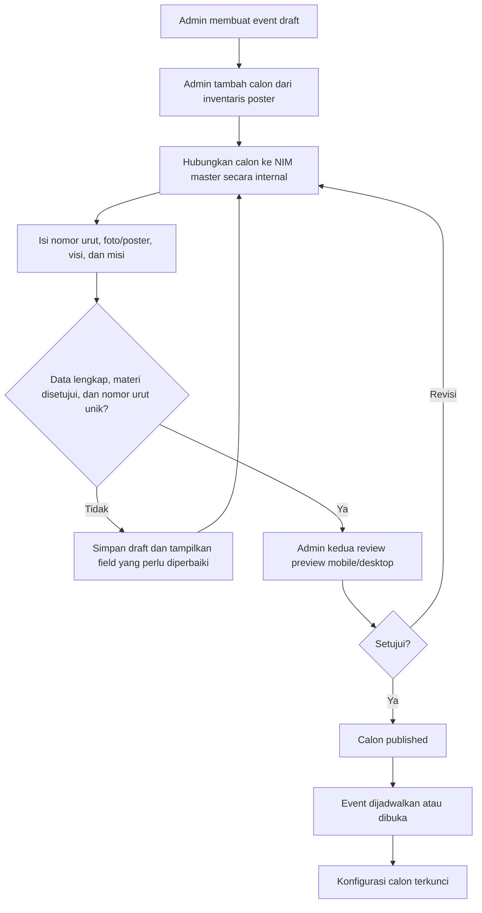

# 11. Setup Calon Individu

Dokumen ini menetapkan setup pemilihan calon individu. Satu suara selalu memilih **satu calon**, bukan pasangan Ketua–Wakil dan bukan beberapa calon sekaligus.

Sembilan poster sumber tersedia pada folder `paslon/`. Nama folder tersebut dipertahankan sebagai lokasi aset; ia tidak menentukan model pemilihan. Poster menyebut “Calon BPH Angkatan 2026”, sehingga panitia wajib mengesahkan bahwa daftar ini memang kandidat sah untuk posisi/event yang akan dibuka sebelum status kandidat diubah menjadi `published`.

Rincian aset, kelas yang tertulis pada poster, visi, dan misi berada di `14-inventaris-materi-calon.md`.
Mapping NIM restricted untuk setup tersedia pada `data/mapping-calon-nim-internal.md`; jangan pernah memindahkan data tersebut ke materi publik.

## Aturan dasar

| Konsep | Aturan |
| --- | --- |
| Calon | Satu individu pada satu pilihan ballot. |
| Nomor urut | Integer positif unik per event, ditetapkan admin dan tidak diambil otomatis dari prefix nama file poster. |
| Materi publik | Nomor urut, nama, kelas, dan foto/poster yang sudah direview. Tidak memuat NIM. |
| Relasi internal | Setiap calon harus dipetakan ke satu `Voter` pada master berdasarkan NIM yang diverifikasi admin. |
| Status | `draft`, `ready`, `published`, atau `archived`. Hanya `published` terlihat dan dapat dipilih saat event `open`. |

Gunakan `Candidate` sebagai nama domain, tabel, dan API. `Vote` menyimpan `candidate_id`; hasil live menghitung suara setiap calon.

## Alur setup oleh admin



## Form admin: calon

### A. Identitas ballot

| Field | Wajib | Validasi | Tampil publik |
| --- | --- | --- | --- |
| Nomor urut | Ya | Integer positif dan unik per event; terkunci setelah open. | Ya. |
| Nama tampilan | Ya | Maks. 80 karakter; harus cocok dengan materi yang disetujui. | Ya. |
| Slug | Ya | URL-safe dan unik per event; dibuat otomatis, boleh disesuaikan saat draft. | Tidak; identifier katalog internal. |
| Kelas sumber | Ya | Cocok dengan poster dan master peserta setelah diverifikasi. | Boleh ditampilkan bila panitia menyetujui. |
| NIM internal | Ya sebelum publish | String digit yang cocok dengan satu voter master; tidak tampil publik. | Tidak. |
| Aksen visual | Ya | Token warna aksesibel; tidak menjadi satu-satunya pembeda calon. | Ya. |

### B. Materi publik

| Field | Batas | Aturan |
| --- | --- | --- |
| Foto/poster sumber | Wajib sebelum publish | Hanya file yang disetujui panitia; MIME, ukuran, dan hak penggunaan tervalidasi. |
| Turunan/crop poster | Tidak digunakan | Card selalu memakai file poster sumber dengan rasio asli; jangan memotong atau mengubah identitas. |
| Visi | 1 paragraf | Disimpan sebagai transkripsi katalog internal yang diverifikasi terhadap poster; tidak dirender pada UI visitor. |
| Misi | 3–5 poin | Plain text/rich text allowlist; urutan mengikuti materi yang disetujui. |
| Bio/tagline | Opsional | Maks. 240/120 karakter; tidak memuat kontak pribadi atau NIM. |

Visi dan misi tetap disimpan sebagai teks di database untuk review, audit, dan sinkronisasi katalog. Pada rilis ini keduanya tidak dirender atau diindeks di UI visitor; galeri publik hanya memakai nomor, nama, kelas, dan poster yang telah disetujui.

## Status calon dan aturan perubahan

| Status | Arti | Aksi admin yang diizinkan |
| --- | --- | --- |
| `draft` | Data belum lengkap/belum direview. | Semua field dapat diubah atau diarsipkan. |
| `ready` | Validasi teknis lulus dan menunggu review admin kedua. | Preview dan kirim untuk review. |
| `published` | Terlihat publik dan masuk ballot ketika event open. | Perubahan materi hanya sebelum event open dan harus diaudit. |
| `archived` | Tidak lagi tampil/dipilih. | Read-only; tetap ada di audit. |

Saat event berubah ke `open`, daftar calon published, nomor urut, relasi voter, serta materi publik dikunci. Koreksi darurat wajib mengikuti SOP dan persetujuan dua akun admin berbeda.

## Kebijakan hak pilih calon

Panitia menetapkan satu keputusan eksplisit sebelum daftar pemilih dikunci:

| Opsi | Dampak |
| --- | --- |
| Calon tetap eligible | NIM calon tetap ada pada master dan dapat memilih seperti visitor lain. |
| Calon tidak eligible | NIM calon ditandai `is_eligible = false` dengan alasan `candidate_member`. |

Tidak ada default. Keputusan dicatat pada konfigurasi event, bukan ditentukan oleh UI.

## Preview wajib sebelum publish

Admin kedua memastikan:

- nomor urut tampil konsisten pada landing, ballot, hasil live, dan ekspor;
- nama, kelas sumber, serta NIM internal terverifikasi terhadap poster dan master pemilih secara independen; mapping awal bukan pengganti pemeriksaan;
- foto/poster tidak terpotong pada 320 px, tablet, dan desktop;
- transkripsi visi/misi sama dengan materi yang disetujui, aman dari HTML/script, dan tidak ikut dirender pada UI visitor;
- pilihan calon dapat dibedakan oleh nomor/nama, bukan warna saja;
- modal konfirmasi menampilkan ringkasan calon, sementara receipt tidak menyebut calon pilihan.

## Model data calon

```text
Candidate
  id, election_id, voter_id, ballot_number, display_name, slug,
  source_class_name, photo_key, poster_key, tagline, vision,
  status, accent_token, published_at, timestamps

CandidateMission
  id, candidate_id, sort_order, text

Vote
  ... candidate_id ...
```

Constraint wajib:

1. `UNIQUE(election_id, ballot_number)` pada `Candidate`.
2. `UNIQUE(election_id, voter_id)` pada `Candidate`, agar satu orang tidak tampil dua kali dalam event yang sama.
3. `Vote.candidate_id` wajib terkait calon `published` pada election yang sama saat event open.
4. Hasil live mengagregasi `Vote` sah per `candidate_id` dan menampilkan nomor/nama calon, bukan nama voter.
5. Prefix angka pada file poster hanya metadata sumber; tidak pernah menjadi nomor urut secara otomatis.

## Dokumen yang diselaraskan

| Dokumen/area | Kontrak yang dipakai |
| --- | --- |
| `02-alur-voting.md` | Pemilih memilih satu calon dan mengirim `candidateId`. |
| `04-ui-ux-dan-visual.md` | Kartu/detail/hasil menampilkan satu calon per pilihan. |
| `07-kontrak-data.md` | `candidates` dan `votes.candidate_id`. |
| `08-kontrak-api-dan-realtime.md` | Payload/result memakai `candidateId` dan `candidateResults`. |
| `10-quality-gate-dan-pengujian.md` | Test validasi calon, nomor urut, dan relasi calon-voter. |
