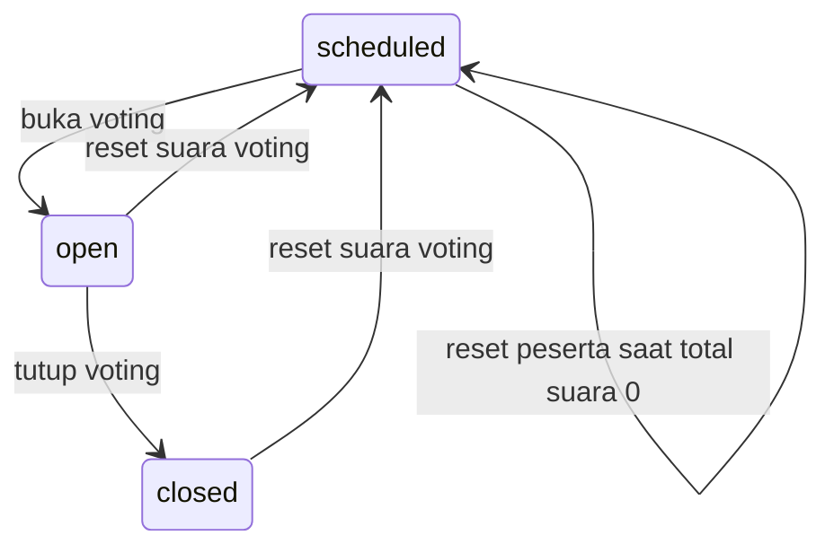

# 13. Reset dan Pengulangan Pemilihan

## Prinsip utama

Reset pada aplikasi ini memakai dua tindakan admin yang berurutan. Ia tidak mengubah calon, materi calon, akun admin, atau audit; audit selalu mempertahankan actor dan alasan reset.

| Tindakan | Kapan tersedia | Dampak | Nama tombol yang dipakai |
| --- | --- | --- | --- |
| Reset suara voting | Admin yang telah login, pada state event apa pun. | Menghapus vote/receipt, sesi, dan rate limit voting; peserta tetap ada sampai aksi reset peserta berikutnya. | `Reset suara voting` |
| Reset peserta | Event `scheduled` dan total suara `0`. | Menghapus daftar peserta dan sisa sesi verifikasi. | `Reset peserta` |

Nama tombol selalu spesifik agar admin memahami urutan dan dampaknya.

## Keputusan rancangan aplikasi

Untuk scope aplikasi ini, panel admin menambahkan **dua** aksi reset yang wajib dijalankan berurutan: `Reset suara voting`, lalu `Reset peserta`. Tidak ada tombol reset calon, akun admin, konfigurasi, atau materi calon.

| Aksi UI | Tujuan | Kapan dapat dijalankan | Data yang berubah | Data yang tetap ada |
| --- | --- | --- | --- | --- |
| `Reset suara voting` | Mengosongkan suara agar peserta dapat dikelola ulang. | Admin telah login, memasukkan alasan, dan mengetik konfirmasi yang tepat. | Vote, receipt, sesi voting, serta rate limit `vote.*`; event kembali `scheduled` dan hasil tersembunyi. | Daftar peserta, calon, akun admin, konfigurasi kandidat, dan audit lama; satu audit reset baru ditambahkan. |
| `Reset peserta` | Menghapus daftar NIM setelah suara benar-benar kosong. | Event `scheduled` dan total suara `0`. | `voters` dan sisa `voting_sessions`; event tetap `scheduled` dan hasil tersembunyi. | Calon, akun admin, konfigurasi kandidat, vote yang sudah tidak ada, dan audit lama; satu audit reset baru harus ditambahkan. |

Urutan ini disengaja: `Reset peserta` tidak dapat ditekan atau dipanggil bila masih ada suara. Pada UI, ia disabled dengan pesan **“Kosongkan suara voting terlebih dahulu.”** Server juga menghitung ulang jumlah vote dalam transaction sebelum menghapus peserta, sehingga request langsung tidak dapat melompati tahap pertama. Reset suara tersedia bagi admin tanpa setup environment tambahan; karena itu alasan, konfirmasi teks, audit, dan lock event wajib tetap dipertahankan.

### Pengaman `Reset suara voting`

Server wajib memeriksa seluruh pengaman berikut di dalam Server Action, bukan sekadar menyembunyikan tombol:

1. Sesi admin yang valid diperiksa di server.
2. Admin mengisi alasan minimal delapan karakter dan mengetik `RESET SUARA VOTING` secara persis.
3. Event dikunci lalu dikembalikan ke `scheduled` sebelum sesi dan suara dihapus, sehingga vote yang sedang diproses tidak dapat lolos setelah reset.
4. Semua perubahan terjadi dalam satu transaction dan audit menyimpan actor serta alasan tanpa pilihan calon individual.

Jika satu pengaman tidak lolos, action menolak tanpa mengubah baris mana pun. Akses tanpa sesi admin dan penghapusan melalui query manual di luar aplikasi tidak termasuk workflow ini.

### Urutan transaksi reset suara voting

Server melakukan satu transaction dengan urutan:

1. set event menjadi `scheduled`, hasil `hidden`, dan perbarui waktu;
2. hapus `voting_sessions` event;
3. hapus `votes` event beserta receipt yang melekat pada baris tersebut;
4. hapus rate-limit dengan scope `vote.verify` dan `vote.submit`; dan
5. tambahkan audit `election.votes_reset` berisi actor dan alasan tanpa NIM atau pilihan per orang.

Peserta, kandidat, dan akun admin tidak boleh ikut terhapus. Setelah transaction selesai, UI menampilkan `0 suara` dan tombol `Reset peserta` menjadi aktif; browser tidak menyimpan receipt lama sebagai bukti event baru.

### Urutan transaksi reset peserta

Server memeriksa ulang bahwa event tidak `open` dan jumlah vote adalah `0`, lalu melakukan satu transaction:

1. hapus `voting_sessions` event yang tersisa;
2. hapus `voters` event;
3. set event tetap `scheduled`, hasil `hidden`, dan perbarui waktu; lalu
4. tambahkan audit `election.voters_reset` dengan actor dan alasan tanpa NIM.

Jika query hitung vote menemukan satu suara pun, transaction dibatalkan dengan `event_has_votes`. Kandidat dan akun admin tetap tidak berubah.

## Aturan state dan izin



Hanya akun `admin` dapat melihat dan menjalankan area ini. Reset suara membutuhkan alasan dan teks konfirmasi; reset peserta tetap dikunci sampai server mengonfirmasi jumlah suara nol.

## Rancangan UI admin

Area ini berada di **Panitia → Konfigurasi → Danger Zone** dan tidak tampil pada visitor.

Sebelum tombol final aktif, UI wajib menampilkan:

- nama event, status, jumlah vote sah, dan tindakan yang akan terjadi;
- daftar data yang **tidak** akan dihapus;
- field alasan wajib dan input konfirmasi yang spesifik untuk tindakan;
- pesan bahwa reset peserta terkunci sampai jumlah suara nol.

Tidak memakai tombol merah tunggal tanpa konfirmasi, animasi glamor, atau copy seperti `hapus semua`.

### Susunan Danger Zone yang direkomendasikan

```text
┌ 1. Reset suara voting ───────────────────────────────────────┐
│ 1 suara · 437 peserta                                        │
│ Akan menghapus suara, receipt, sesi, dan rate limit voting.  │
│ [Alasan] [Ketik RESET SUARA VOTING] [Reset suara voting]      │
├ 2. Reset peserta ────────────────────────────────────────────┤
│ Terkunci sampai jumlah suara menjadi 0.                        │
│ Akan menghapus daftar peserta dan sisa sesi verifikasi.       │
│ [Alasan] [Ketik RESET PESERTA] [Reset peserta]                │
└──────────────────────────────────────────────────────────────┘
```

Jumlah pada contoh hanya ilustrasi UI; aplikasi harus mengambil hitungan aktual. Tombol yang tidak memenuhi guard tetap tampil sebagai disabled **dengan alasan spesifik** dan tautan SOP, bukan sekadar disabled tanpa penjelasan.

## Kontrak API dan data

| Endpoint konseptual | Kondisi | Hasil |
| --- | --- | --- |
| Server Action `resetVotesAction` | Sesi admin, alasan, dan `RESET SUARA VOTING`. | Event menjadi `scheduled`; suara/receipt/sesi/rate limit dihapus dan audit ditambah. |
| Server Action `resetVotersAction` | Sesi admin, event `scheduled`, total vote `0`, alasan, dan `RESET PESERTA`. | Peserta/sesi tersisa dihapus dan audit ditambah. |

Kode kesalahan yang wajib dipahami UI: `event_has_votes`, konfirmasi tidak valid, status event tidak sesuai, atau sesi admin tidak tersedia.

Audit minimum memuat ID event lama/baru, tipe tindakan, actor pengaju/penyetuju, alasan, state dan jumlah vote sebelum tindakan, baseline/config snapshot yang dipakai, request ID, serta waktu. Audit tidak memuat pilihan calon individual atau token mentah.

## Acceptance test

| ID | Skenario | Bukti lulus |
| --- | --- | --- |
| RST-01 | Visitor atau admin tanpa sesi memanggil action reset. | Ditolak tanpa mengubah suara atau peserta. |
| RST-02 | Admin memasukkan alasan atau konfirmasi reset suara yang tidak valid. | Server menolak tanpa mengubah data. |
| RST-03 | Admin mereset suara pada event `open`. | Event menjadi `scheduled`, hasil disembunyikan, peserta tetap ada, dan audit tercatat. |
| RST-04 | Submit vote dan reset suara terjadi berdekatan. | Lock event memastikan tidak ada vote baru tersisa setelah reset selesai. |
| RST-05 | Admin mencoba reset peserta saat masih ada satu suara. | Tombol menjelaskan alasan penguncian dan server menolak request langsung tanpa mengubah peserta. |
| RST-06 | Admin mereset peserta setelah reset suara menghasilkan 0 vote. | Peserta dan sesi hilang, calon/audit tetap ada, event `scheduled`. |
| RST-07 | Setelah reset suara, receipt lama dibuka dan vote baru dikirim dari NIM sama. | Receipt lama tidak ditemukan; NIM dapat diverifikasi dan memberi satu vote baru pada data yang bersih. |

Lihat juga `08-kontrak-api-dan-realtime.md`, `09-sop-panitia.md`, dan `10-quality-gate-dan-pengujian.md` untuk integrasi API, SOP, serta pengujian.
