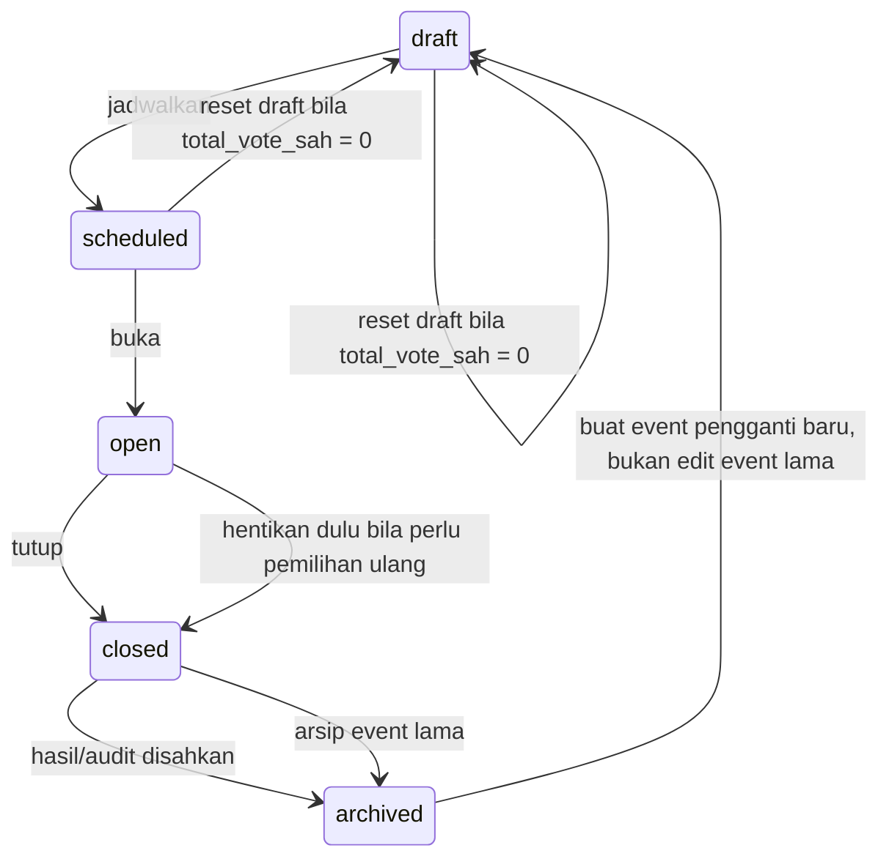
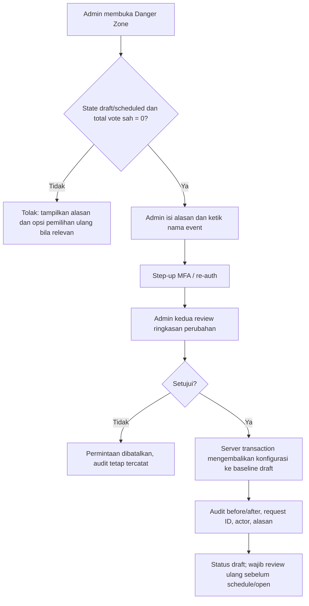

# 13. Reset dan Pengulangan Pemilihan

## Prinsip utama

Tidak ada tombol produksi yang langsung menghapus seluruh suara, mengosongkan hasil, atau membuat NIM dapat memilih lagi pada event yang sama. Tindakan tersebut merusak audit dan dapat menurunkan kepercayaan terhadap hasil pemilihan.

Istilah **reset** dibedakan menjadi tiga tindakan dengan batas yang tegas.

| Tindakan | Kapan tersedia | Dampak | Nama tombol yang dipakai |
| --- | --- | --- | --- |
| Reset draft | Event `draft`/`scheduled` dan belum memiliki vote sah. | Mengembalikan konfigurasi draft ke kondisi awal yang disetujui; audit/import snapshot tetap tersimpan. | `Reset draft` |
| Reset simulasi | Hanya local atau staging, memakai data dummy. | Menghapus data test event, vote test, sesi, dan idempotency test. | `Reset data simulasi` |
| Pemilihan ulang | Event production sudah memiliki vote sah, telah dibuka, atau telah ditutup. | Menutup/mengarsipkan event lama dan membuat event pengganti baru yang kosong. Data event lama tetap utuh. | `Buat pemilihan ulang` |

Tombol umum bernama `Reset voting` tidak digunakan pada production karena maknanya ambigu dan berisiko disalahpahami.

## Aturan state dan izin



Hanya akun `admin` dapat melihat area ini. Setiap aksi sensitif membutuhkan dua akun admin yang berbeda: satu mengajukan, satu menyetujui. Akun kedua tidak boleh menyetujui aksinya sendiri.

| Kondisi event | `Reset draft` | `Buat pemilihan ulang` | Penjelasan |
| --- | --- | --- | --- |
| `draft`, tanpa vote | Diizinkan | Tidak perlu | Konfigurasi belum live; audit perubahan tetap ada. |
| `scheduled`, tanpa vote | Diizinkan, kembali ke `draft` | Tidak perlu | Jadwal dan konfigurasi harus direview ulang. |
| `open`, tanpa vote | Ditolak sampai event ditutup/kembali ke draft melalui SOP. | Tidak langsung | Status publik tidak boleh berubah diam-diam. |
| `open`, ada vote | Ditolak | Setelah event ditutup; buat event baru. | Vote awal tidak dapat dihapus. |
| `closed`/`archived` | Ditolak | Diizinkan sebagai event baru setelah persetujuan. | Event lama merupakan artefak audit. |

## Alur `Reset draft`



### Yang boleh dan tidak boleh direset

| Data | Reset draft | Catatan |
| --- | --- | --- |
| Form event, jadwal, visibility, konten calon draft | Boleh kembali ke baseline atau dikosongkan sesuai pilihan eksplisit. | Detail pilihan ditampilkan sebelum konfirmasi. |
| Import yang belum di-commit | Boleh dibuang dari draft. | Hash file, metadata upload, dan audit tetap tersimpan restricted. |
| Master pemilih yang sudah di-commit | Tidak dihapus massal. | Gunakan import pengganti/override terdokumentasi. |
| Vote sah, receipt, audit, checksum ekspor | Tidak boleh. | Jika ada satu vote pun, reset ditolak. |
| Calon published/terkunci | Tidak boleh diubah lewat reset setelah open. | Gunakan event pengganti bila pemilihan diulang. |

## Alur `Buat pemilihan ulang`

Jika voting sudah berjalan lalu panitia secara resmi memutuskan mengulang pemilihan, admin tidak mengubah hasil lama. Prosedurnya:

1. Admin penanggung jawab menutup event lama sesuai SOP dan mencatat alasan pengulangan.
2. Dua admin menyetujui pembuatan event pengganti.
3. Server membuat `Election` baru dengan ID dan slug baru, misalnya `ketua-pgsd-2026-ulang`.
4. Konfigurasi non-sensitif, calon, dan daftar master **boleh disalin sebagai draft** hanya setelah preview dan persetujuan ulang. Tidak ada vote, receipt, sesi, risk signal, atau idempotency record yang ikut disalin.
5. Panitia menetapkan jadwal baru, memverifikasi kembali hak pilih/calon, lalu menjalankan UAT singkat sebelum membuka event baru.
6. Event lama berubah ke `archived` dengan tautan internal ke event pengganti dan alasan; halaman publik menampilkan pengumuman faktual sesuai keputusan panitia.

`Election` pengganti menyimpan `restarted_from_election_id` sebagai relasi lineage. Rekap event lama dan baru tidak boleh digabung otomatis, karena keduanya adalah pemilihan yang berbeda.

## Rancangan UI admin

Area ini berada di **Panitia → Konfigurasi → Danger Zone** dan tidak tampil pada visitor.

```text
┌──────────────────────────────────────────────────────────────┐
│ Danger Zone                                                   │
│ Event: Ketua & Wakil Ketua PGSD 2026 · scheduled · 0 vote    │
│                                                              │
│ [Reset draft]                                                 │
│ Kembalikan konfigurasi draft. Audit dan import metadata aman.│
│                                                              │
│ Event sudah memiliki suara?                                  │
│ [Buat pemilihan ulang]                                       │
│ Menutup/mengarsipkan event lama lalu membuat draft baru.     │
└──────────────────────────────────────────────────────────────┘
```

Sebelum tombol final aktif, UI wajib menampilkan:

- nama event, status, jumlah vote sah, dan tindakan yang akan terjadi;
- daftar data yang **tidak** akan dihapus;
- field alasan wajib dan input ketik ulang nama event;
- status persetujuan admin kedua;
- pesan bahwa browser refresh/tombol back tidak mengulang tindakan karena menggunakan idempotency key.

Tidak memakai tombol merah tunggal tanpa konfirmasi, animasi glamor, atau copy seperti `hapus semua`.

## Kontrak API dan data

| Endpoint konseptual | Kondisi | Hasil |
| --- | --- | --- |
| `POST /admin/elections/{id}/reset-draft-request` | `draft`/`scheduled`, `total_cast = 0`, re-auth. | Membuat permintaan reset pending. |
| `POST /admin/reset-requests/{id}/approve` | Admin penyetuju berbeda, state masih valid. | Menjalankan reset transaction dan audit. |
| `POST /admin/elections/{id}/create-replacement-request` | Event lama ditutup/diarsipkan, reason wajib. | Membuat permintaan event pengganti. |
| `POST /admin/replacement-requests/{id}/approve` | Admin penyetuju berbeda. | Membuat draft event baru dengan lineage. |

Kode kesalahan yang wajib dipahami UI: `reset_not_allowed`, `event_has_votes`, `event_state_changed`, `second_admin_required`, `reauth_required`, `replacement_not_ready`, dan `idempotency_conflict`.

Audit minimum memuat ID event lama/baru, tipe tindakan, actor pengaju/penyetuju, alasan, state dan jumlah vote sebelum tindakan, baseline/config snapshot yang dipakai, request ID, serta waktu. Audit tidak memuat pilihan calon individual atau token mentah.

## Khusus simulasi

`Reset data simulasi` hanya diaktifkan jika environment secara eksplisit `local` atau `staging` dan event diberi flag `is_test = true`. Endpoint/button ini tidak dibundle atau tidak dapat dipanggil pada production. Ia tidak boleh menerima file spreadsheet peserta asli.

Sebelum reset simulasi, sistem memastikan database dan host bukan production. Jika pemeriksaan environment tidak pasti, tindakan harus fail-closed dan ditolak.

## Acceptance test

| ID | Skenario | Bukti lulus |
| --- | --- | --- |
| RST-01 | Admin mencoba reset draft dengan 0 vote pada state `draft`. | Memerlukan re-auth + persetujuan admin kedua; draft berubah dan audit tercatat. |
| RST-02 | Admin mencoba reset event dengan 1 vote sah. | Ditolak `event_has_votes`; data tidak berubah. |
| RST-03 | Pengaju mencoba menyetujui reset sendiri. | Ditolak `second_admin_required`. |
| RST-04 | Dua klik/permintaan reset dengan idempotency key sama. | Hanya satu tindakan/audit final. |
| RST-05 | Pemilihan ulang event closed. | Event baru memiliki ID/slug baru, lineage benar, dan 0 vote; event lama tetap utuh. |
| RST-06 | Endpoint reset simulasi dipanggil pada production. | Ditolak/fail-closed dan tercatat alert. |

Lihat juga `08-kontrak-api-dan-realtime.md`, `09-sop-panitia.md`, dan `10-quality-gate-dan-pengujian.md` untuk integrasi API, SOP, serta pengujian.
