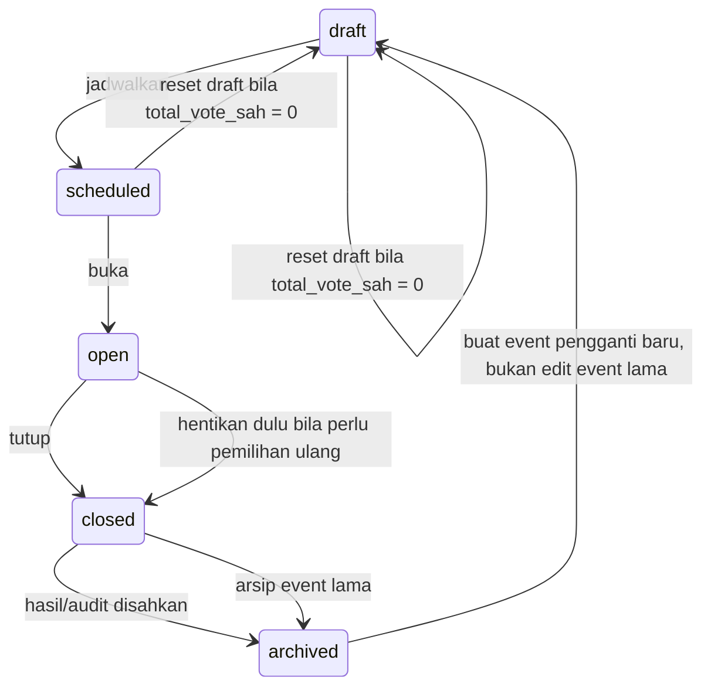
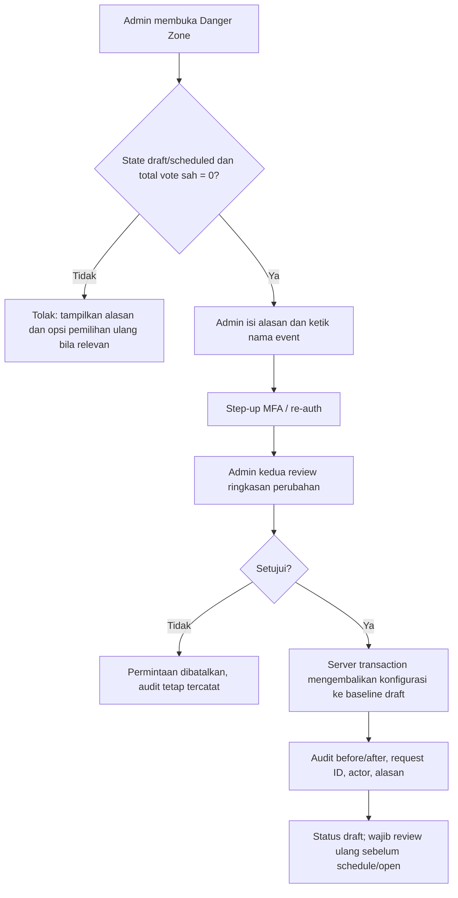

# 13. Reset dan Pengulangan Pemilihan

## Prinsip utama

Tidak ada tombol produksi yang langsung menghapus seluruh suara, mengosongkan hasil, atau membuat NIM dapat memilih lagi pada event yang sama. Tindakan tersebut merusak audit dan dapat menurunkan kepercayaan terhadap hasil pemilihan.

Istilah **reset** dibedakan menjadi tiga tindakan dengan batas yang tegas.

| Tindakan | Kapan tersedia | Dampak | Nama tombol yang dipakai |
| --- | --- | --- | --- |
| Reset draft | Event `draft`/`scheduled` dan belum memiliki vote sah. | Mengembalikan konfigurasi draft ke kondisi awal yang disetujui; audit/import snapshot tetap tersimpan. | `Reset draft` |
| Reset suara voting simulasi | Hanya local atau staging, memakai data dummy. | Menghapus vote test/receipt, sesi, dan rate limit voting; peserta tetap ada sampai aksi reset peserta berikutnya. | `Reset suara voting` |
| Pemilihan ulang | Event production sudah memiliki vote sah, telah dibuka, atau telah ditutup. | Menutup/mengarsipkan event lama dan membuat event pengganti baru yang kosong. Data event lama tetap utuh. | `Buat pemilihan ulang` |

Tombol umum bernama `Reset voting` tidak digunakan pada production karena maknanya ambigu dan berisiko disalahpahami.

## Keputusan rancangan aplikasi

Untuk scope aplikasi ini, panel admin menambahkan **dua** aksi reset yang wajib dijalankan berurutan: `Reset suara voting`, lalu `Reset peserta`. Tidak ada tombol reset calon, akun admin, konfigurasi, atau materi calon. Tata kelola pemilihan ulang production pada bagian berikut tetap menjadi SOP, bukan fitur reset langsung di panel.

| Aksi UI | Tujuan | Kapan dapat dijalankan | Data yang berubah | Data yang tetap ada |
| --- | --- | --- | --- | --- |
| `Reset suara voting` | Mengosongkan suara uji agar peserta dapat dikelola ulang. | Hanya database `development` atau Vercel Preview yang diberi marker test dan semua guard environment lulus. | Vote uji, receipt uji, sesi voting, serta rate limit `vote.*`; event kembali `scheduled` dan hasil tersembunyi. | Daftar peserta, calon, akun admin, konfigurasi kandidat, dan audit lama; satu audit reset baru harus ditambahkan. |
| `Reset peserta` | Menghapus daftar NIM setelah suara benar-benar kosong. | Event tidak `open` dan total suara `0`. | `voters` dan sisa `voting_sessions`; event tetap `scheduled` dan hasil tersembunyi. | Calon, akun admin, konfigurasi kandidat, vote yang sudah tidak ada, dan audit lama; satu audit reset baru harus ditambahkan. |

Urutan ini disengaja: `Reset peserta` tidak dapat ditekan atau dipanggil bila masih ada suara. Pada UI, ia disabled dengan pesan **“Kosongkan suara voting terlebih dahulu.”** Server juga menghitung ulang jumlah vote dalam transaction sebelum menghapus peserta, sehingga request langsung tidak dapat melompati tahap pertama. `Reset suara voting` tidak boleh tampil atau dapat dipanggil pada Production. Bila event resmi telah memiliki suara, tidak ada tombol hapus; SOP pemilihan ulang memakai event baru.

### Guard `Reset suara voting`

Reset suara hanya merupakan alat pengujian, bukan fitur production. Server wajib memeriksa **seluruh** guard berikut di dalam transaction/action, bukan sekadar menyembunyikan tombol:

1. `APP_ENV` bernilai `development` atau `preview`; bila `VERCEL_ENV=production`, selalu tolak.
2. Flag server-only `ALLOW_SIMULATION_RESET=true` tersedia.
3. Event memiliki marker `is_test=true` yang disimpan di database. Marker tidak boleh dapat diubah dari halaman admin biasa.
4. Database yang dipakai adalah database test/Preview yang berbeda dari Production dan tidak pernah berisi spreadsheet peserta resmi.
5. Admin mengisi alasan, mengetik `RESET SUARA VOTING`, dan mengirim idempotency key baru.
6. Untuk Preview/production-like deployment, akun admin kedua yang berbeda menyetujui permintaan. Local development boleh memakai satu admin, tetapi audit tetap wajib.

Jika satu guard tidak lolos, endpoint mengembalikan `simulation_reset_not_allowed` tanpa mengubah baris mana pun. `DELETE FROM votes` generik atau akses reset lewat URL/API tanpa guard tidak boleh ada.

### Urutan transaksi reset suara voting

Server menghitung ringkasan tanpa PII lebih dahulu (`total_vote`, `total_voter`, `total_session`), menyimpannya pada audit, lalu melakukan satu transaction dengan urutan:

1. nonaktifkan event secara atomik dan hapus `voting_sessions` event;
2. hapus `votes` event beserta receipt uji yang melekat pada baris tersebut;
3. hapus rate-limit dengan scope `vote.verify` dan `vote.submit` pada database test;
4. set event menjadi `scheduled`, hasil `hidden`, perbarui waktu; dan
5. tambahkan audit `simulation.vote_reset` berisi actor, approver bila ada, reason, request ID, dan hitungan suara sebelum/hasil akhir tanpa NIM atau pilihan per orang.

Peserta, kandidat, dan akun admin tidak boleh ikut terhapus. Setelah transaction selesai, UI menampilkan `0 suara` dan tombol `Reset peserta` menjadi aktif; browser tidak menyimpan receipt lama sebagai bukti event baru.

### Urutan transaksi reset peserta

Server memeriksa ulang bahwa event tidak `open` dan jumlah vote adalah `0`, lalu melakukan satu transaction:

1. hapus `voting_sessions` event yang tersisa;
2. hapus `voters` event;
3. set event tetap `scheduled`, hasil `hidden`, dan perbarui waktu; lalu
4. tambahkan audit `simulation.voters_reset` atau `election.voters_reset` sesuai environment, dengan actor, reason, request ID, dan hitungan peserta sebelum/hasil akhir tanpa NIM.

Jika query hitung vote menemukan satu suara pun, transaction dibatalkan dengan `event_has_votes`. Kandidat dan akun admin tetap tidak berubah.

## Aturan state dan izin



Hanya akun `admin` dapat melihat area ini. Setiap aksi sensitif membutuhkan dua akun admin yang berbeda: satu mengajukan, satu menyetujui. Akun kedua tidak boleh menyetujui aksinya sendiri.

| Kondisi event | `Reset draft` | `Buat pemilihan ulang` | Penjelasan |
| --- | --- | --- | --- |
| `draft`, tanpa vote | Diizinkan | Tidak perlu | Konfigurasi belum live; audit perubahan tetap ada. |
| `scheduled`, tanpa vote | Diizinkan, kembali ke `draft` | Tidak perlu | Jadwal dan konfigurasi harus direview ulang. |
| `open`, tanpa vote | Ditolak sampai event ditutup/kembali ke draft melalui SOP. | Tidak langsung | Status publik tidak boleh berubah diam-diam. |
| `open`, ada vote | Ditolak | Setelah event ditutup; buat event baru. | Vote awal tidak dapat dihapus. |
| `closed`/`archived` | Ditolak | Diizinkan sebagai event baru setelah persetujuan. | Event lama merupakan artefak audit. |

## Alur `Reset draft`



### Yang boleh dan tidak boleh direset

| Data | Reset draft | Catatan |
| --- | --- | --- |
| Form event, jadwal, visibility, konten calon draft | Boleh kembali ke baseline atau dikosongkan sesuai pilihan eksplisit. | Detail pilihan ditampilkan sebelum konfirmasi. |
| Import yang belum di-commit | Boleh dibuang dari draft. | Hash file, metadata upload, dan audit tetap tersimpan restricted. |
| Master pemilih yang sudah di-commit | Tidak dihapus massal. | Gunakan import pengganti/override terdokumentasi. |
| Vote sah, receipt, audit, checksum ekspor | Tidak boleh. | Jika ada satu vote pun, reset ditolak. |
| Calon published/terkunci | Tidak boleh diubah lewat reset setelah open. | Gunakan event pengganti bila pemilihan diulang. |

## Alur `Buat pemilihan ulang`

Jika voting sudah berjalan lalu panitia secara resmi memutuskan mengulang pemilihan, admin tidak mengubah hasil lama. Prosedurnya:

1. Admin penanggung jawab menutup event lama sesuai SOP dan mencatat alasan pengulangan.
2. Dua admin menyetujui pembuatan event pengganti.
3. Server membuat `Election` baru dengan ID dan slug baru, misalnya `ketua-pgsd-2026-ulang`.
4. Konfigurasi non-sensitif, calon, dan daftar master **boleh disalin sebagai draft** hanya setelah preview dan persetujuan ulang. Tidak ada vote, receipt, sesi, risk signal, atau idempotency record yang ikut disalin.
5. Panitia menetapkan jadwal baru, memverifikasi kembali hak pilih/calon, lalu menjalankan UAT singkat sebelum membuka event baru.
6. Event lama berubah ke `archived` dengan tautan internal ke event pengganti dan alasan; halaman publik menampilkan pengumuman faktual sesuai keputusan panitia.

`Election` pengganti menyimpan `restarted_from_election_id` sebagai relasi lineage. Rekap event lama dan baru tidak boleh digabung otomatis, karena keduanya adalah pemilihan yang berbeda.

## Rancangan UI admin

Area ini berada di **Panitia → Konfigurasi → Danger Zone** dan tidak tampil pada visitor.

```text
┌──────────────────────────────────────────────────────────────┐
│ Danger Zone                                                   │
│ Event: Ketua & Wakil Ketua PGSD 2026 · scheduled · 0 vote    │
│                                                              │
│ [Reset draft]                                                 │
│ Kembalikan konfigurasi draft. Audit dan import metadata aman.│
│                                                              │
│ Event sudah memiliki suara?                                  │
│ [Buat pemilihan ulang]                                       │
│ Menutup/mengarsipkan event lama lalu membuat draft baru.     │
└──────────────────────────────────────────────────────────────┘
```

Sebelum tombol final aktif, UI wajib menampilkan:

- nama event, status, jumlah vote sah, dan tindakan yang akan terjadi;
- daftar data yang **tidak** akan dihapus;
- field alasan wajib dan input ketik ulang nama event;
- status persetujuan admin kedua;
- pesan bahwa browser refresh/tombol back tidak mengulang tindakan karena menggunakan idempotency key.

Tidak memakai tombol merah tunggal tanpa konfirmasi, animasi glamor, atau copy seperti `hapus semua`.

### Susunan Danger Zone yang direkomendasikan

```text
┌ 1. Reset suara voting (hanya Preview/local) ─────────────────┐
│ PREVIEW · test data · 1 suara uji · 437 peserta uji          │
│ Akan menghapus suara, receipt, sesi, dan rate limit voting.  │
│ [Alasan] [Ketik RESET SUARA VOTING] [Reset suara voting]      │
│ Menunggu persetujuan admin kedua / selesai di local.          │
├ 2. Reset peserta ────────────────────────────────────────────┤
│ Terkunci sampai jumlah suara menjadi 0.                        │
│ Akan menghapus daftar peserta dan sisa sesi verifikasi.       │
│ [Alasan] [Ketik RESET PESERTA] [Reset peserta]                │
├ Pemilihan resmi ─────────────────────────────────────────────┤
│ Tidak ada tombol hapus suara atau peserta. Gunakan SOP ulang.│
└──────────────────────────────────────────────────────────────┘
```

Jumlah pada contoh hanya ilustrasi UI; aplikasi harus mengambil hitungan aktual. Tombol yang tidak memenuhi guard tetap tampil sebagai disabled **dengan alasan spesifik** dan tautan SOP, bukan sekadar disabled tanpa penjelasan.

## Kontrak API dan data

| Endpoint konseptual | Kondisi | Hasil |
| --- | --- | --- |
| `POST /admin/elections/{id}/simulation-vote-reset-request` | Environment test lulus, event `is_test`, reason, re-auth, idempotency key. | Membuat permintaan reset suara pending. |
| `POST /admin/elections/{id}/voters-reset-request` | Event tidak `open`, `total_cast = 0`, reason, re-auth, idempotency key. | Membuat permintaan reset peserta pending. |
| `POST /admin/reset-requests/{id}/approve` | Admin penyetuju berbeda, state masih valid. | Menjalankan reset transaction dan audit. |
| `POST /admin/elections/{id}/create-replacement-request` | Event lama ditutup/diarsipkan, reason wajib. | Membuat permintaan event pengganti. |
| `POST /admin/replacement-requests/{id}/approve` | Admin penyetuju berbeda. | Membuat draft event baru dengan lineage. |

Kode kesalahan yang wajib dipahami UI: `reset_not_allowed`, `simulation_reset_not_allowed`, `event_has_votes`, `event_state_changed`, `second_admin_required`, `reauth_required`, `replacement_not_ready`, dan `idempotency_conflict`.

Audit minimum memuat ID event lama/baru, tipe tindakan, actor pengaju/penyetuju, alasan, state dan jumlah vote sebelum tindakan, baseline/config snapshot yang dipakai, request ID, serta waktu. Audit tidak memuat pilihan calon individual atau token mentah.

## Khusus simulasi

`Reset suara voting` hanya diaktifkan jika environment secara eksplisit `local` atau `staging` dan event diberi flag `is_test = true`. Endpoint/button ini tidak dibundle atau tidak dapat dipanggil pada production. Ia tidak boleh menerima file spreadsheet peserta asli.

Sebelum reset simulasi, sistem memastikan database dan host bukan production. Jika pemeriksaan environment tidak pasti, tindakan harus fail-closed dan ditolak.

## Acceptance test

| ID | Skenario | Bukti lulus |
| --- | --- | --- |
| RST-01 | Admin mencoba reset draft dengan 0 vote pada state `draft`. | Memerlukan re-auth + persetujuan admin kedua; draft berubah dan audit tercatat. |
| RST-02 | Admin mencoba reset event dengan 1 vote sah. | Ditolak `event_has_votes`; data tidak berubah. |
| RST-03 | Pengaju mencoba menyetujui reset sendiri. | Ditolak `second_admin_required`. |
| RST-04 | Dua klik/permintaan reset dengan idempotency key sama. | Hanya satu tindakan/audit final. |
| RST-05 | Pemilihan ulang event closed. | Event baru memiliki ID/slug baru, lineage benar, dan 0 vote; event lama tetap utuh. |
| RST-06 | Endpoint reset suara voting dipanggil pada production. | Ditolak/fail-closed dan tercatat alert. |
| RST-07 | Admin meminta reset suara voting di Preview dengan semua guard terpenuhi. | Vote/receipt/sesi dan rate limit voting hilang dalam satu transaction, peserta tetap ada, count suara menjadi 0, audit memuat hitungan tersensor. |
| RST-08 | Admin mencoba reset peserta saat masih ada satu suara. | Tombol menjelaskan alasan penguncian dan server menolak request langsung tanpa mengubah peserta. |
| RST-09 | Admin mereset peserta setelah reset suara menghasilkan 0 vote. | Peserta dan sesi hilang, calon/audit tetap ada, event `scheduled`. |
| RST-10 | Admin mencoba reset suara voting saat `APP_ENV=production`, flag/marker hilang, atau event bukan test. | Server menolak tanpa mengubah data, sekalipun tombol dipaksa dari request langsung. |
| RST-11 | Setelah reset suara, receipt test lama dibuka dan vote baru dikirim dari NIM sama. | Receipt lama tidak ditemukan; NIM dapat diverifikasi dan memberi satu vote baru pada data test yang bersih. |

Lihat juga `08-kontrak-api-dan-realtime.md`, `09-sop-panitia.md`, dan `10-quality-gate-dan-pengujian.md` untuk integrasi API, SOP, serta pengujian.
