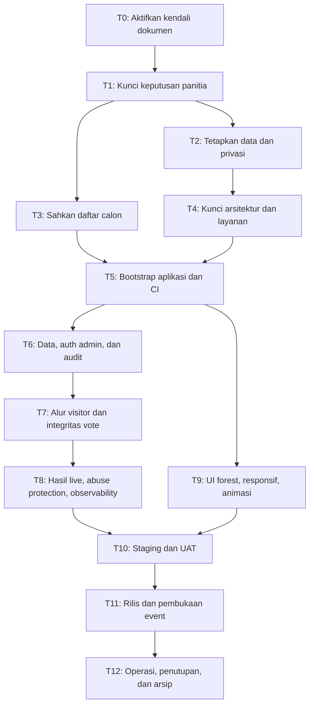

# 15. Runbook Eksekusi Proyek

Dokumen ini menerjemahkan rancangan menjadi urutan kerja yang dapat dijalankan. Ia wajib dibaca bersama `00-pedoman-eksekusi-berbasis-md.md` dan dicatat pada `16-log-eksekusi.md`.

## Cara memakai runbook

- Kerjakan tahap secara berurutan. Paralel hanya diperbolehkan bila baris tahap menyatakannya aman dan dependency sudah lulus.
- Buat minimal satu ID `EXE-*` pada log untuk setiap tahap yang dimulai.
- Kolom **Baca** berisi sumber aturan minimum; kolom **Perbarui** berisi file yang harus diubah bila hasil tahap mengubah keputusan/rancangan.
- Gate bersifat `go/no-go`: apabila belum lulus, pekerjaan selanjutnya berstatus `Blocked`.
- Semua data pemilih/calon restricted hanya dikelola lewat jalur internal dan tidak ditempel pada runbook atau log umum.

### Jalur prototipe lokal sebelum keputusan final

Sesudah T0 `Done`, jalur prototipe dapat berjalan untuk memvalidasi desain hutan, responsivitas, navigasi, kandidat publik, dan hasil **simulasi**. Jalur ini tunduk pada pengecualian prototipe dalam `00-pedoman-eksekusi-berbasis-md.md` dan wajib dicatat sebagai entry `EXE-*` terpisah.

Prototipe tidak sama dengan T5/T9 selesai dan tidak boleh memakai NIM, spreadsheet peserta, akun admin, database/provider production, atau vote yang persist. Halaman dan angka demo harus menandai dirinya sebagai “Demo / belum voting resmi”. Untuk naik ke implementasi voting sesungguhnya, selesaikan T1, T2, T3, dan T4 terlebih dahulu.

## Ringkasan dependency

## T0 — Aktifkan kendali dokumen

| Item | Ketentuan |
| --- | --- |
| Tujuan | Menjadikan Markdown sebagai source of truth sebelum aksi proyek lain. |
| Baca | `README.md`, `00`, `15`, `16`. |
| Aksi | Pastikan semua pelaksana mengetahui aturan `No MD, no action`; buat entry kerja awal; tetapkan lokasi bukti restricted dan siapa admin penanggung jawab. |
| Perbarui | `16`; `README` bila register status berubah. |
| Bukti exit | Entry log aktif, owner/reviewer tercatat, seluruh dokumen indeks dapat dibuka. |
| Gate | Tidak ada import, coding, atau konfigurasi production sebelum T0 `Done`. |

## T1 — Kunci keputusan panitia

| Item | Ketentuan |
| --- | --- |
| Tujuan | Mengubah asumsi penting menjadi keputusan tertulis dan disetujui. |
| Baca | `01-scope-dan-keputusan.md`, `02-alur-voting.md`, `05-rencana-implementasi.md`, `09-sop-panitia.md`, `10-quality-gate-dan-pengujian.md`, `11-setup-calon-individu.md`. |
| Aksi | Tetapkan posisi/event yang dipilih, mode calon individu, kebijakan hak pilih calon, daftar eligible, jadwal buka/tutup WIB, kebijakan hasil live, minimal dua admin, faktor autentikasi tambahan, retensi data, serta penanggung jawab insiden. |
| Perbarui | `01`, `02`, `05`, `09`, `10`, `README`, `16`. |
| Bukti exit | Sign-off panitia beserta tanggal dan versi konfigurasi keputusan. |
| Gate | Tidak boleh setup data final atau deploy sebelum semua keputusan `Approved`. |

## T2 — Siapkan master pemilih dan privasi

| Item | Ketentuan |
| --- | --- |
| Tujuan | Memiliki daftar eligible yang valid tanpa membocorkan data pribadi. |
| Baca | `03-data-dan-keamanan.md`, `07-kontrak-data.md`, `09-sop-panitia.md`, `10-quality-gate-dan-pengujian.md`, `data/daftar-nim-master.md` restricted. |
| Aksi | Tentukan apakah memakai semua master atau hanya peserta hadir; lakukan preview import pada staging dengan prosedur approved; cek NIM sebagai string, duplikasi, count, kelas/eligibility, dan data invalid; tetapkan akses serta retensi. |
| Perbarui | `03`, `07`, `09`, `10`, dokumen restricted yang relevan, `16`. |
| Bukti exit | Laporan preview ter-redaksi, count eligible disetujui, duplikasi/invalid terselesaikan, dan prosedur hapus/retensi ditetapkan. |
| Gate | Import production dilarang sebelum review dua admin. Data production tidak masuk local atau screenshot. |

## T3 — Sahkan dan setup calon individu

| Item | Ketentuan |
| --- | --- |
| Tujuan | Menyediakan calon yang sah, lengkap, dan siap ditampilkan. |
| Baca | `11-setup-calon-individu.md`, `14-inventaris-materi-calon.md`, `data/mapping-calon-nim-internal.md` restricted, `09-sop-panitia.md`. |
| Aksi | Konfirmasi bahwa poster memang mewakili event/posisi yang disetujui; review nama publik, kelas, foto, visi-misi, izin aset, mapping calon–voter, nomor urut, dan kebijakan hak pilih calon. |
| Perbarui | `11`, `14`, mapping restricted, `09`, `16`. |
| Bukti exit | Admin kedua menyetujui tiap calon; nomor urut unik; preview mobile/desktop disetujui; semua kandidat masih `draft`/`ready` sampai event siap. |
| Gate | Tidak ada kandidat `published` tanpa dua-review; nomor pada nama file poster bukan nomor ballot. |

## T4 — Kunci arsitektur, provider, dan environment

| Item | Ketentuan |
| --- | --- |
| Tujuan | Menghilangkan keputusan teknis yang dapat mengubah keamanan/integritas di tengah implementasi. |
| Baca | `05-rencana-implementasi.md`, `06-arsitektur-teknis.md`, `07-kontrak-data.md`, `08-kontrak-api-dan-realtime.md`, `10-quality-gate-dan-pengujian.md`, `12-rute-dan-seo.md`. |
| Aksi | Pilih database/ORM, auth+MFA admin, object storage, realtime, hosting, observability, secret management, environment local/staging/production, dan strategy backup/rollback. Catat biaya/data residency bila relevan. |
| Perbarui | `05`, `06`, `07`, `08`, `10`, `12`, `16`; tambahkan ADR jika keputusan berdampak besar. |
| Bukti exit | Arsitektur serta provider disetujui; threat model dan environment matrix selesai; akses production dibatasi. |
| Gate | Tidak ada data final pada provider yang belum disetujui. |

## T5 — Bootstrap aplikasi dan pipeline kualitas

| Item | Ketentuan |
| --- | --- |
| Tujuan | Membuat fondasi Next.js/TypeScript yang dapat diuji dan tidak mengandung data nyata. |
| Baca | `04-ui-ux-dan-visual.md`, `05`, `06`, `10`, `12`. |
| Aksi | Inisialisasi proyek, Tailwind, lint/typecheck/test/build, environment validation, CI, secret scan, fixture dummy, base layout, metadata/routing, dan mekanisme excluded path untuk `docs/data/`. |
| Perbarui | `05`, `06`, `10`, `12`, `16`. |
| Bukti exit | CI hijau pada proyek kosong/kerangka; build tidak mempublikasikan restricted docs; local/staging menggunakan data dummy. |
| Gate | Tidak boleh memasang analitik/SDK yang mengirim NIM atau data vote. |

## T6 — Implementasi data, admin, dan audit

| Item | Ketentuan |
| --- | --- |
| Tujuan | Menegakkan model event, calon, eligible voter, admin, audit, dan constraint database. |
| Baca | `03`, `06`, `07`, `08`, `09`, `10`, `11`, `13`. |
| Aksi | Buat migration, state machine event, admin authentication+MFA, policy authorization, import preview/commit, setup calon, audit append-only, reset draft/pemilihan ulang, dan ekspor restricted. |
| Perbarui | `06`, `07`, `08`, `09`, `10`, `11`, `13`, `16`. |
| Bukti exit | Unit/integration test untuk constraint, admin-only policy, audit, import, candidate–voter uniqueness, dan reset lulus. |
| Gate | Tidak ada panel admin yang dapat diakses visitor; tidak ada reset event yang memiliki vote sah. |

## T7 — Implementasi alur visitor dan integritas voting

| Item | Ketentuan |
| --- | --- |
| Tujuan | Menghasilkan satu suara sah per pemilih eligible tanpa mengungkap pilihan atau PII. |
| Baca | `02`, `03`, `04`, `07`, `08`, `10`, `11`. |
| Aksi | Buat landing, daftar/detail calon, verifikasi NIM, session vote, ballot satu calon, konfirmasi, submit atomik/idempoten, receipt, recovery error, dan page state sebelum/sesudah voting. |
| Perbarui | `02`, `03`, `04`, `07`, `08`, `10`, `12` bila rute berubah, `16`. |
| Bukti exit | `VOT-01`–`VOT-06`, `API-01`, `API-02`, dan `SEC-01` lulus pada database setara production. |
| Gate | Dua submit paralel harus menghasilkan tepat satu vote; UI bukan sumber otorisasi, server wajib menegakkan aturan. |

## T8 — Hasil live, mitigasi abuse, dan observability

| Item | Ketentuan |
| --- | --- |
| Tujuan | Menyajikan hasil agregat yang benar dan menjaga sistem dapat dipantau tanpa PII. |
| Baca | `02`, `03`, `06`, `08`, `09`, `10`. |
| Aksi | Implementasi agregat per calon sesuai visibility hasil, realtime dengan fallback polling, revision/versioning, cache policy, rate limit, CAPTCHA adaptif, monitoring, alert, status page, backup/restore, dan audit access. |
| Perbarui | `02`, `03`, `06`, `08`, `09`, `10`, `16`. |
| Bukti exit | `RES-01`–`RES-03`, `OPS-01`, `OPS-02`, dan load test target lulus; dashboard tidak menampilkan pilihan personal. |
| Gate | Kegagalan realtime tidak boleh menghasilkan angka salah atau menghentikan integritas submit vote. |

## T9 — Implementasi visual, animasi, aksesibilitas, dan SEO

| Item | Ketentuan |
| --- | --- |
| Tujuan | Menerapkan tema hutan hijau–merah yang colorful dan sinematik, tanpa mengganggu voting. |
| Baca | `04-ui-ux-dan-visual.md`, `05-rencana-implementasi.md`, `10-quality-gate-dan-pengujian.md`, `12-rute-dan-seo.md`. |
| Aksi | Bangun token warna, responsive layout, layer forest/parallax/kabut/daun, Motion/GSAP/Lenis/R3F secara modular, fallback 2D, reduced motion, keyboard focus, semantic HTML, metadata, sitemap, robots, dan Search Console readiness. |
| Perbarui | `04`, `05`, `10`, `12`, `16`. |
| Bukti exit | Visual test ukuran 320–1440 px, `A11Y-01`, `VIS-01`, audit performance, dan metadata/rute diverifikasi. |
| Gate | Animasi/3D harus lazy-load, berhenti pada reduced motion, dan tidak ada pada jalur submit kritis bila mengganggu performa. SEO tidak boleh menjanjikan peringkat nomor satu. |

T8 dan T9 dapat berjalan paralel setelah T5, tetapi keduanya harus selesai sebelum T10.

## T10 — Staging, simulasi, dan UAT

| Item | Ketentuan |
| --- | --- |
| Tujuan | Membuktikan sistem dan SOP bekerja end-to-end sebelum production. |
| Baca | `05`, `09`, `10`, `13`, `15`, `16`. |
| Aksi | Jalankan test suite, simulasi pemilih serentak, retry, network failure, realtime down, import, reset dummy, close event, export/reconciliation, backup restore, incident tabletop, dan UAT panitia. |
| Perbarui | `09`, `10`, `13`, `16`, `README` bila keputusan berubah. |
| Bukti exit | Semua acceptance wajib lulus, temuan kritis/tinggi tertutup, UAT/sign-off tercatat, daftar blocker kosong. |
| Gate | Tidak ada go-live bila hanya UI yang selesai tetapi integritas, privasi, atau operasi belum lulus. |

## T11 — Rilis dan pembukaan event

| Item | Ketentuan |
| --- | --- |
| Tujuan | Merilis konfigurasi final dengan risiko perubahan minimal. |
| Baca | `09-sop-panitia.md`, `10-quality-gate-dan-pengujian.md`, `12-rute-dan-seo.md`, `13-reset-dan-pengulangan-event.md`, `16-log-eksekusi.md`. |
| Aksi | Deploy production reviewed, jalankan migration/smoke test, verifikasi HTTPS/SEO/routing, import final melalui dua admin, publish calon, snapshot konfigurasi, aktifkan monitoring, lalu ikuti runbook pembukaan T-60 sampai T+5 pada SOP. |
| Perbarui | `09`, `10`, `12`, `13`, `16`, `README` status. |
| Bukti exit | Build/version, migration, config snapshot, health check, dan dua-admin approval tersimpan; status event diverifikasi visitor dan admin. |
| Gate | Setelah freeze, hanya perubahan SEV-1/SEV-2 yang diizinkan dengan approval sesuai SOP. |

## T12 — Operasi, penutupan, sengketa, dan arsip

| Item | Ketentuan |
| --- | --- |
| Tujuan | Menutup event secara dapat direkonsiliasi dan menjaga bukti/privasi pasca-event. |
| Baca | `03`, `09`, `10`, `13`, `16`. |
| Aksi | Monitoring tanpa mengubah konfigurasi, pencatatan insiden, close otomatis/terverifikasi, rekonsiliasi rekap, ekspor restricted + checksum, pengumuman, masa sengketa, retensi/penghapusan sesuai kebijakan, dan postmortem bila perlu. |
| Perbarui | `03`, `09`, `10`, `13`, `16`, `README` status final. |
| Bukti exit | Rekap final disetujui, arsip tersedia restricted, PII mengikuti retensi, incident/void selesai, dan status event `closed`/`archived`. |
| Gate | Vote lama tidak boleh dihapus atau diedit untuk “merapikan” hasil; pemilihan ulang memakai event baru sebagaimana `13`. |

## Checklist go/no-go ringkas

Sebelum memasuki production, semua pernyataan ini harus bernilai **ya**:

- [ ] T0–T4 selesai serta keputusan panitia/sign-off tersedia.
- [ ] Data eligible dan semua calon sudah direview dua admin.
- [ ] Implementasi data/admin, vote, hasil, UI, dan SEO memenuhi kontrak dokumen.
- [ ] Test integritas concurrent, PII redaction, accessibility, performance, backup/restore, dan UAT lulus.
- [ ] Provider, domain HTTPS, secret, MFA, monitoring, backup, rollback, dan contact tree siap.
- [ ] Dokumen restricted tidak ikut build/deploy/SEO dan log publik tidak mengandung PII.
- [ ] Release freeze, konfigurasi final, dan runbook T-60 sudah disetujui.

Satu jawaban **tidak** berarti production `Blocked` sampai entry kerja pemulihan selesai dan direview.
