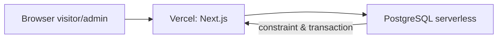

# 10. Deployment Vercel dan PostgreSQL Serverless

Dokumen ini adalah runbook deployment untuk aplikasi yang ada saat ini. Ia melengkapi kontrak keamanan dan alur voting; tidak memberi izin untuk membuka event, mengimpor peserta production, atau membagikan secret.

## Arsitektur runtime

- Vercel menjalankan halaman dan Route Handler Next.js secara serverless. Disk function tidak dipakai untuk state pemilihan.
- PostgreSQL serverless adalah source of truth untuk event, calon, peserta, sesi, vote, rate limit, dan audit.
- Setiap instance aplikasi boleh mulai kapan saja; integritas suara tidak bergantung pada memori atau file instance.
- Schema dasar dan katalog calon dibuat idempoten ketika aplikasi pertama kali dapat mengakses database. Unique constraint `(election_id, voter_id)` tetap menjadi lapisan final pencegah suara ganda.

## Prasyarat

1. Repository terhubung ke project Vercel.
2. Database PostgreSQL serverless sudah tersedia, misalnya melalui integrasi Neon di Vercel Marketplace.
3. Panitia memiliki pengelola password/secret manager untuk menyimpan nilai environment variable.
4. Domain production HTTPS dan pemilik operasional telah disahkan sebelum event dibuka.

## Environment variable

Atur variable di Vercel Project Settings → Environment Variables. Nilai rahasia tidak boleh dimasukkan ke source, issue, log, screenshot, atau spreadsheet.

| Nama | Scope | Ketentuan |
| --- | --- | --- |
| `DATABASE_URL` | Development, Preview, Production | URL PostgreSQL serverless. Gunakan database terpisah per lingkungan; hak akses hanya untuk aplikasi. `POSTGRES_URL` dapat dipakai sebagai nama alternatif. |
| `VOTING_TOKEN_SECRET` | Development, Preview, Production | Nilai acak minimal 32 karakter dan berbeda pada setiap lingkungan. Menjadi syarat server untuk membuka voting. |
| `ADMIN_INITIAL_USERNAME` | Development, Preview, Production | Opsional; default `admin@pppk-pgsd.vercel.app`. Hanya dipakai ketika database environment belum memiliki akun admin. |
| `ADMIN_INITIAL_PASSWORD` | Development, Preview, Production | Secret baru minimal 12 karakter dan berbeda per lingkungan. Dipakai sekali untuk membuat akun admin awal; tidak boleh masuk source atau `NEXT_PUBLIC_*`. |
| `APP_ENV` | Development dan Preview saja | Isi `development` atau `preview` hanya untuk database test yang membutuhkan reset suara. Production tidak memakai nilai yang mengaktifkan simulasi. |
| `SIMULATION_EVENT_ENABLED` | Development dan Preview saja | `true` untuk memberi marker test pada event database test saat schema dijalankan. Jangan pasang pada Production. |
| `ALLOW_SIMULATION_RESET` | Development dan Preview saja | `true` hanya bila reset suara test memang diperlukan. Server tetap menolak jika `VERCEL_ENV=production`. |
| `NEXT_PUBLIC_SITE_URL` | Production | URL HTTPS canonical tanpa trailing slash, misalnya `https://voting.example.ac.id`. Jangan gunakan URL preview sebagai canonical. |

Tidak ada `VOTING_DB_PATH`. Database SQLite/file lokal tidak kompatibel dengan filesystem Vercel yang tidak persisten.

## Urutan deploy

1. Jalankan `npm install`, `npm run typecheck`, `npm run lint`, dan `npm run build` pada commit yang akan dirilis.
2. Di Vercel, import repository dan gunakan framework preset **Next.js**. `package.json` mematok runtime Node `24.x`; jangan override ke runtime lama.
3. Pasang database serverless dan masukkan lima variable di atas pada environment yang tepat. Pastikan Preview tidak menunjuk database Production.
4. Deploy Preview terlebih dahulu. Kunjungi `/` dan `/panitia/login`; request pertama akan menyiapkan schema idempoten pada database environment tersebut.
5. Bila Preview dipakai untuk UAT berulang, isi `APP_ENV=preview`, `SIMULATION_EVENT_ENABLED=true`, dan `ALLOW_SIMULATION_RESET=true` **hanya** pada environment Preview sebelum schema pertama kali dipakai. Login memakai username/password awal environment Preview untuk membuat admin test, kemudian lakukan UAT dengan spreadsheet salinan aman dan NIM dummy. Jangan unggah master peserta production pada Preview.
6. Setelah reviewer menyetujui UAT, promote commit yang sama ke Production dan isi variable Production yang berbeda.
7. Buka `/panitia/login` di domain production, buat admin pertama, sinkronkan calon, lalu lakukan setup event mengikuti `../19-operasional-aplikasi.md`.
8. Sebelum klik **Buka voting**, selesaikan checklist T10 dan catat keputusan pada `../16-log-eksekusi.md`.

## Smoke test setelah deploy

| Pemeriksaan | Hasil aman yang diharapkan |
| --- | --- |
| `/` | HTTP `200`, memiliki satu H1, kandidat yang published saja, tanpa NIM/hasil rahasia. |
| `/vote` saat `scheduled` | Tidak memberikan akses surat suara. |
| `/panitia/login` | Memungkinkan pembuatan akun awal/login tanpa mengungkap secret environment pada HTML atau log. |
| `/robots.txt` dan `/sitemap.xml` | Hanya canonical publik yang dapat diindeks. |
| Verifikasi NIM test | Pesan generik untuk NIM tidak sah; token sesi singkat hanya untuk NIM test yang eligible. |
| Submit test | Hanya satu insert vote per NIM test; retry dengan idempotency key sama menerima receipt yang sama. |
| Reset suara test | Hanya Preview/local dengan tiga guard simulasi; setelahnya event menjadi `scheduled`, vote menjadi `0`, dan peserta tetap ada. |
| Reset peserta | Baru aktif setelah suara `0`; menghapus NIM test tanpa mengubah calon atau audit. |

## Kegagalan, rollback, dan operasi

- Jika `DATABASE_URL` belum ada atau database tidak dapat diakses, aplikasi harus gagal tertutup. Jangan membuka event atau menyimpan vote di browser.
- Bila deploy UI bermasalah sebelum voting dibuka, rollback deployment Vercel ke build terakhir yang diketahui baik; database tidak perlu di-rollback untuk perubahan UI.
- Bila perubahan schema/logic telah dipakai atau ada suara sah, jangan melakukan rollback database secara spontan. Tutup voting bila integritas tidak dapat dipastikan, catat insiden, lalu ikuti `../09-sop-panitia.md`.
- Backup/snapshot database dilakukan sebelum UAT production, sebelum membuka event, dan sebelum tindakan administratif material. Uji pemulihan pada database terpisah.
- Bila `ADMIN_INITIAL_PASSWORD` diduga bocor sebelum akun awal dibuat, ganti secret di Vercel sebelum mencoba login. Setelah akun terbentuk, perubahan variable ini tidak mengubah password database; pemulihan perlu prosedur admin terpisah. Rotasi token sesi akan membuat sesi aktif berakhir; jadwalkan di luar periode voting.

## Batas implementasi saat ini

- PostgreSQL menyimpan rate limit sederhana sehingga ia konsisten di banyak instance Vercel, tetapi bukan pengganti proteksi DDoS/CDN provider.
- Tidak ada MFA/SSO/OTP kampus, CAPTCHA adaptif, provider realtime, atau ekspor arsip pada build ini. Jangan mengklaim kontrol tersebut telah aktif.
- Data peserta harus diimpor dari panel admin pada database environment tujuan; database lokal SQLite lama tidak dimigrasikan otomatis.
- Vote dan PII tidak boleh masuk Vercel Analytics, log aplikasi, URL, sitemap, metadata, atau preview public.

## Gate release

- [ ] Environment Production memakai database production yang tepat dan backup awal dibuat.
- [ ] `DATABASE_URL`, `VOTING_TOKEN_SECRET`, dan `ADMIN_INITIAL_PASSWORD` tidak kosong serta berbeda dari Preview; `ADMIN_INITIAL_USERNAME` sudah dikonfirmasi.
- [ ] `APP_ENV`, `SIMULATION_EVENT_ENABLED`, dan `ALLOW_SIMULATION_RESET` tidak diatur untuk mengaktifkan simulasi pada Production.
- [ ] Build/lint/typecheck hijau pada commit release.
- [ ] UAT Preview tercatat tanpa spreadsheet maupun NIM production.
- [ ] Canonical URL, robots, sitemap, dan HTTPS diverifikasi.
- [ ] Dua panitia yang ditunjuk menyetujui import peserta dan pembukaan event.
- [ ] Entry release di `../16-log-eksekusi.md` berisi commit, waktu WIB, reviewer, dan hasil UAT ter-redaksi.
